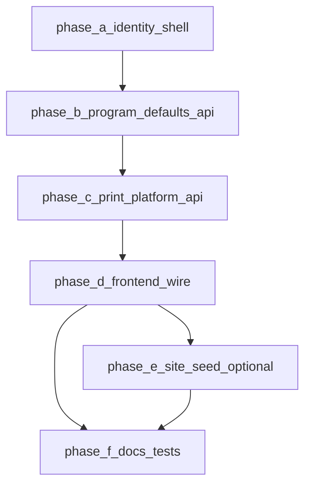

# Super admin Configuration — robust coordinated plan

## Product boundaries (do not violate)

These rules prevent “wrong direction” refactors.

| Concern                                                              | super_admin                                                                          | site `admin`                                                   |
| -------------------------------------------------------------------- | ------------------------------------------------------------------------------------ | -------------------------------------------------------------- |
| Programs / tokens / analytics APIs                                   | **No access** (unchanged)                                                            | Yes (site-scoped)                                              |
| `/api/admin/token-tts-settings` (Audio & TTS site config)            | **No access**                                                                        | Yes                                                            |
| `/api/admin/system/storage`                                          | **No UI** on Configuration page; may remain callable only if needed elsewhere        | Configuration tab                                              |
| Global **program default** template (`program_default_settings` row) | **Read/write**                                                                       | **Read/write** (same row — platform template for new programs) |
| **Print**                                                            | **Platform default** row (`print_settings.site_id` null) via **dedicated** endpoints | **Site-scoped** `/api/admin/print-settings`                    |
| TTS Generation (integrations, platform budget)                       | **Yes** (existing routes)                                                            | **No**                                                         |

**Spec anchor:** `[routes/web.php](routes/web.php)` comments reference `SUPER-ADMIN-VS-ADMIN-SPEC`. This work adds **narrow exceptions**: program-default-settings access + new print-platform endpoints. It does **not** reopen the large `role:admin` API group to `super_admin`.

---

## Why the UI looked “unchanged” (diagnosis, not guesswork)

`[resources/js/Pages/Admin/Settings/Index.svelte](resources/js/Pages/Admin/Settings/Index.svelte)` already branches on `authUser?.role === "super_admin"`. Four tabs imply the `**else`** branch.

**Pre-implementation verification (must pass before blaming code):**

1. **Database:** `users.role` for the logged-in user is `super_admin` (`[app/Enums/UserRole.php](app/Enums/UserRole.php)`).
2. **Inertia payload:** First document response includes `auth.user.role` as the string `super_admin` (not only `{ value: ... }` from a client bug).
3. **Assets:** Dev server or fresh `npm run build` + hard refresh so `Index.svelte` changes are loaded.

**Hardening (recommended, single source of truth):** Add `auth.is_super_admin` (boolean) in `[app/Http/Middleware/HandleInertiaRequests.php](app/Http/Middleware/HandleInertiaRequests.php)` from `$user?->isSuperAdmin()` (or equivalent on `[User](app/Models/User.php)`). Update `Index.svelte` to use **boolean OR** string for one release if needed, then prefer boolean only.

---

## Coordinated execution order

Work in this order so nothing depends on missing pieces.

| Phase | Delivers                                                                         | Blocks                     |
| ----- | -------------------------------------------------------------------------------- | -------------------------- |
| **A** | Shared `is_super_admin` + super_admin subnav shell (three tabs, placeholders OK) | Confirms UX before APIs    |
| **B** | `GET/PUT /api/admin/program-default-settings` for `admin` **and** `super_admin`  | Program defaults tab loads |
| **C** | `GET/PUT` (+ upload) for platform print defaults, `super_admin` only             | Default print tab loads    |
| **D** | Wire `ProgramDefaultsTab`, `PrintSettingsTab variant="platform"`, `?tab=`        | Full flow                  |
| **E** | On site create, copy platform print row → new `site_id`                          | Operational consistency    |
| **F** | PHPUnit matrix + `[docs/architecture/TTS.md](docs/architecture/TTS.md)`          | Release quality            |

---

## Phase B — Program default settings API (surgical route change)

**Wrong approach:** Change the entire `Route::middleware(['auth', 'role:admin'])->prefix('api/admin')` group to include `super_admin` — that would expose programs, tokens, print-settings, token-tts, analytics to super_admin.

**Correct approach:** **Extract only** these two routes into a separate group:

- `GET /api/admin/program-default-settings`
- `PUT /api/admin/program-default-settings`

Middleware: `['auth', 'role:admin,super_admin']`.

Leave `[ProgramDefaultSettingsController](app/Http/Controllers/Api/Admin/ProgramDefaultSettingsController.php)` unchanged unless authorization must be asserted again in the controller (optional `abort_unless` for clarity).

**Comment update:** Replace the blanket “super_admin has no access” line at the top of the admin block with a precise note: which routes remain admin-only vs which are shared.

---

## Phase C — Platform default print settings (new surface)

**Wrong approach:** Reuse `[PrintSettingsController](app/Http/Controllers/Api/Admin/PrintSettingsController.php)` with “if super_admin then null site” — mixes two security models in one class and risks accidental exposure.

**Correct approach:** New controller (e.g. `PrintPlatformDefaultsController`) + explicit repository methods:

- `getPlatformTemplate(): PrintSetting` — `firstOrCreate` / `whereNull('site_id')` with documented defaults (`[PrintSettingRepository](app/Repositories/PrintSettingRepository.php)`).
- **Do not** rely on legacy `getInstance(null)` “first row wins” for new code; make platform row **explicit**.

**Data integrity:**

- `print_settings.site_id` is nullable with a unique index ([migration](database/migrations/2026_03_14_300000_add_site_id_to_print_settings_table.php)). MySQL allows multiple NULLs in UNIQUE; **application rule:** at most one template row with `site_id IS NULL` — enforce in repository (first match + log/warn if duplicates).

**Routes (example names — keep consistent in code):**

- `GET /api/admin/print-platform-default-settings`
- `PUT /api/admin/print-platform-default-settings`
- `POST /api/admin/print-platform-default-settings/image` (or mirror existing `/print-settings/image` shape)

Middleware: `**role:super_admin` only** — site admins never edit the platform template via these endpoints.

---

## Phase D — Frontend coordination

**File:** `[resources/js/Pages/Admin/Settings/Index.svelte](resources/js/Pages/Admin/Settings/Index.svelte)`

**Super admin tabs (final):**

1. **TTS Generation** — existing `[TtsGenerationTab.svelte](resources/js/Pages/Admin/Settings/TtsGenerationTab.svelte)`
2. **Program defaults** — existing `[ProgramDefaultsTab.svelte](resources/js/Pages/Admin/Settings/ProgramDefaultsTab.svelte)` (same API after Phase B)
3. **Default print settings** — `[PrintSettingsTab.svelte](resources/js/Pages/Admin/Settings/PrintSettingsTab.svelte)` with `variant="platform"` (new prop): labels + API base paths

**Tab query params:** Define a small map so `?tab=` is unambiguous:

- Super admin: `tts-generation` | `program-defaults` | `print-platform` (or `print-defaults` — pick one canonical key and document)
- Site admin: unchanged (`storage`, `program-defaults`, `print`, `token-tts`)

**Explicitly not rendered for super_admin:** Storage, Audio & TTS (`TokenTtsSettingsTab`).

---

## Phase E — Site creation (recommended)

When a new site is created in `[SiteController::store](app/Http/Controllers/Api/Admin/SiteController.php)`, after `save()`:

- Create `PrintSetting` for `site_id = $site->id` by **copying** field values (and resolving file paths if logo/bg are stored as paths) from the platform template row.

If omitted, document that the first `firstOrCreate` on the site still applies site defaults from code defaults — weaker than “copy template.”

---

## Testing matrix (Phase F)

| Actor         | program-default-settings | print-settings (site) | print-platform-default-settings | token-tts-settings |
| ------------- | ------------------------ | --------------------- | ------------------------------- | ------------------ |
| `admin`       | 200                      | 200 (with site)       | **403**                         | 200                |
| `super_admin` | 200                      | **403** (no site)     | 200                             | **403**            |

Use existing feature test patterns under `[tests/Feature/Api/](tests/Feature/Api/)`.

---

## Documentation

- `[docs/architecture/TTS.md](docs/architecture/TTS.md)`: super_admin Configuration tabs + endpoint list.
- Optional: one paragraph in `[docs/architecture/05-SECURITY-CONTROLS.md](docs/architecture/05-SECURITY-CONTROLS.md)` if it exists — **exceptions** to admin-only API for platform templates.

---

## Rollback / risk

- **Low risk:** Moving two routes to a new middleware group (Phase B) — behavior change is limited.
- **Medium risk:** Platform print row + site copy — test duplicate NULL rows and migration edge cases on staging DB backup.

