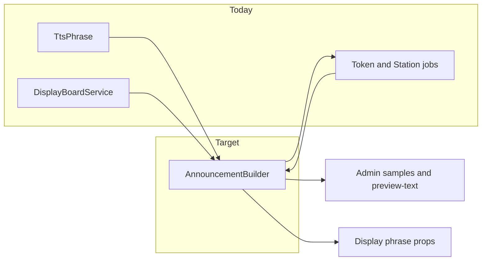

# TTS refactor plan (consolidated)

Single source of truth for the greenfield-aligned TTS refactor: mental model, storage, backend, frontend, testing, rollout, and recommended extras.

---

## 1. Success criteria and non-goals

**Done when:**

- Every spoken line on the display is traceable to **segment 1** (token + site) or **segment 2** (program + station).
- Jobs, admin samples, and display text rules share **`AnnouncementBuilder`** (no drift).
- `prefer_generated_audio` and `segment_2_enabled` are **explicit branches** in `displayTts.js`, not accidental 503 fallthrough.
- Product toggles live in **`token_tts_settings`** (DB), not duplicated in `.env` / `config` for the same behavior.
- `docs/architecture/TTS.md` matches JSON shapes and UI entry points.

**Non-goals (unless explicitly added):** Replacing ElevenLabs; large unrelated Programs UI redesign; changing `en`/`fil`/`ilo` set.

---

## 2. Mental model — two segments, two owners

| Segment | Composition (illustrative) | Owner |
| -------- | -------------------------- | ----- |
| **Segment 1** | `pre_phrase` (“Calling”) + spoken token (`token_phrase` or ID phonetics) + optional **token-bridge tail** (site, per lang) | **Site** `token_tts_settings` + **per-token** overrides |
| **Segment 2** | Program `connector_phrase` + station `station_phrase` or name | **Program** + **station** |

**Rules:**

- Anything that is “how we say the token / lead-in” → segment 1 / site+token.
- Anything that is “how we say the window/station” → segment 2 / program+station.
- **Do not collapse** the token-bridge tail (site) with the program segment-2 connector (“to” / “sa”).

**When `segment_2_enabled` is false:** After segment 1, append **only** the active language’s `closing_without_segment2` from site `default_languages[lang]`. After `trim()`, **empty or missing = append nothing** (segment 1 only).

---

## 3. Storage — one home per concern

| Concern | Location | Notes |
| ------- | -------- | ----- |
| Default voice, rate, `pre_phrase`, `token_phrase` | `token_tts_settings.default_languages.{en,fil,ilo}` | Existing; extend |
| **Token-bridge tail** (segment 1 end, per lang) | Same: `default_languages.{lang}.token_bridge_tail` | New; migrate off hardcoded tails in PHP |
| **Closing when segment 2 off** (per lang) | Same: `default_languages.{lang}.closing_without_segment2` | New; **same UI card** as other per-lang segment-1 fields; empty allowed |
| **Playback booleans** | **`token_tts_settings.playback`** (JSON column) | New column recommended; **not** a parallel `en`/`fil`/`ilo` map for closing |
| Program segment-2 connector | `program.settings.tts.connector.languages.*` | Unchanged |
| Station phrase | `station.settings.tts.languages.*` | Unchanged |
| Generated files | `storage/app/tts/` | Unchanged |

**Anti-pattern:** Same semantic flag in `.env`, `config/tts.php`, and DB. **Keys and drivers** stay in env/config; **product toggles** = `playback` + per-lang fields above.

### 3.1 Target JSON shapes

**Column `playback` (nullable; default on migrate = current effective behavior, typically all “on”):**

```json
{
  "prefer_generated_audio": true,
  "allow_custom_pronunciation": true,
  "segment_2_enabled": true
}
```

**Per language inside `default_languages.en` (repeat for `fil`, `ilo`):**

```json
{
  "voice_id": "...",
  "rate": 1.0,
  "pre_phrase": "Calling",
  "token_phrase": "",
  "token_bridge_tail": "please proceed to",
  "closing_without_segment2": ""
}
```

| Flag | Behavior |
| ---- | -------- |
| `prefer_generated_audio: false` | Display announcements: **browser speech for both segments** (or segment 1 + closing). **No** reliance on `/api/public/tts` fetch failure for announcements — **explicit branch** in `displayTts.js`. |
| `segment_2_enabled: false` | No segment 2 audio/speech; after segment 1, append `closing_without_segment2[activeLang]` only if non-empty after trim. |
| `allow_custom_pronunciation: false` | Hide `token_phrase`, `station_phrase`, and similar **custom pronunciation** inputs on Token + Station modals. **Do not** use this to hide program `connector_phrase` (that is segment-2 structure, not “pronunciation”). |

Expose `playback` and the relevant `default_languages` subset to **Display** via Inertia / public board props (and realtime if already used).

---

## 4. Backend — two jobs, one phrase builder

**Class:** `App\Services\Tts\AnnouncementBuilder`

**Recommended methods:**

- `buildSegment1(Token $token, TokenTtsSetting $site, string $lang, ?array $mergedLangConfig = null): string` — merge site + token overrides; one internal helper for spacing/join (`pre_phrase`, spoken part, `token_bridge_tail`).
- `buildSegment2(Station $station, Program $program, string $lang): string` — canonical segment 2 text (today: logic from `DisplayBoardService::getSecondSegmentText` moved here).
- `buildClosingWhenSegment2Disabled(TokenTtsSetting $site, string $lang): string` — trimmed closing or `''`.
- Optional: `spokenTokenPartForBroadcast(...)` — align `StationActivity` / `token_spoken_by_lang` with segment 1 body rules.

**Callers:**

- `GenerateTokenTtsJob` → `buildSegment1` + `TtsService`.
- `GenerateStationTtsJob` → `buildSegment2` + `TtsService`.
- `DisplayBoardService` → delegate to builder (or thin façade).
- Admin sample / preview endpoints → same methods as jobs.

**`TtsPhrase`:** Keep as low-level helpers (phonetics); **only** `AnnouncementBuilder` assembles full segment strings for product behavior.

---

## 5. Frontend — display (`displayTts.js` + boards)

**Props contract (minimum):**

- `prefer_generated_audio`, `segment_2_enabled` (bools from `playback`).
- Active TTS language (`en` | `fil` | `ilo`).
- Resolved or mappable `closing_without_segment2` for active lang (from server props).

**Required branches:**

1. `prefer_generated_audio === false` — browser TTS path for announcements; **do not** infer this from 503.
2. `prefer_generated_audio === true` — existing generated-audio path; document whether missing-file fallback to browser is allowed (product decision).
3. `segment_2_enabled === false` — segment 1 then optional closing only.
4. `segment_2_enabled === true` — segment 1 then segment 2.

**Files:** `resources/js/lib/displayTts.js`, `resources/js/Pages/Display/Board.svelte`, `resources/js/Pages/Display/StationBoard.svelte`.

---

## 6. Frontend — admin preview contract

**Module:** `resources/js/lib/ttsPreview.js` (extend; `.ts` only if project adopts TS here).

- `previewSegment1(...)` — Config tab, Tokens page.
- `previewSegment2(...)` — Program → Stations; **full** segment 2 (connector + station phrase), not connector-only as the only control.

**Recommended:** Admin **`GET` JSON endpoint** (e.g. preview phrase text) built with `AnnouncementBuilder` so **client never re-implements** join rules; `playAdminTtsPreview` consumes the returned `text`.

| Context | Sample plays |
| ------- | ------------- |
| Token / Config “Segment 1” | Segment 1 only |
| Program / station | Segment 2 full |
| Config tab | **Two** buttons: segment 1 + segment 2 (segment 2 preview: document placeholder program/station or require program context) |

**503 note:** Admin preview may still fall back to browser TTS when server audio fails; **display** with `prefer_generated_audio: false` must **skip** announcement server fetch by design.

---

## 7. Admin UI (by screen)

- **Configuration → Audio & TTS (`TokenTtsSettingsTab.svelte`):** Section **Playback** (three toggles). Per **language** card: existing fields + `token_bridge_tail` + `closing_without_segment2` with helper copy (“Closing only when segment 2 is off; leave empty to end after segment 1.”). **Two** sample buttons.
- **Tokens (`Index.svelte`):** `previewSegment1`; gate `token_phrase` on `allow_custom_pronunciation`.
- **Programs → Stations (`Show.svelte`):** `previewSegment2` primary; optional connector-only secondary if product wants it; gate station phrase customization on `allow_custom_pronunciation`.

---

## 8. Testing matrix

| Layer | Coverage |
| ----- | -------- |
| **Unit** | `AnnouncementBuilder`: segment 1/2, merges, empty `token_bridge_tail` / `closing_without_segment2`, three langs; parity with pre-refactor fixtures |
| **Feature** | Token TTS settings GET/PUT, validation errors, defaults for missing `playback` |
| **Feature** | Optional: admin preview-text endpoint returns expected strings |
| **Playwright (optional)** | Display: segment 2 on; segment 2 off + empty closing; segment 2 off + text; `prefer_generated_audio` false → no announcement `fetch` to public TTS (network assertion) |

Run PHPUnit before closing each todo; add Playwright when display props are stable.

---

## 9. Migration and rollout

1. Add `playback` JSON column + nullable defaults consistent with legacy behavior.
2. Add optional keys to `default_languages` entries; builder treats missing as empty string.
3. Optional one-time backfill / seeder for `token_bridge_tail` from current hardcoded copy, then remove hardcoding from builder only.
4. Document behavior change for ops when toggles flip (CHANGELOG or internal release note).

---

## 10. Recommended extras (operability and quality)

1. **Admin preview-text endpoint** — Returns `{ "text": "..." }` from `AnnouncementBuilder` for segment 1 or 2; eliminates client/server drift.
2. **Job failure UX** — Keep or improve token/station `status` on failed generation; single admin-facing hint (queue, voice id, provider).
3. **Rate limiting** — Align public TTS route with security/architecture docs; admin routes authenticated.
4. **Debug logging** — Optional log when display chooses browser-only branch (debug channel) for field diagnosis.
5. **Pre-merge checklist** — Config save, token generate, station generate, main Board + StationBoard, three languages, two segment-2-off cases (empty vs non-empty closing).
6. **Bead split** — A: Builder + tests; B: Migration + API; C: Display + props; D: Admin UI; E: Docs + optional E2E.

---

## 11. Implementation order (strict, with substeps)

1. **AnnouncementBuilder** — Implement + PHPUnit parity; wire `GenerateTokenTtsJob`, `GenerateStationTtsJob`, `DisplayBoardService`; wire one admin code path (sample or preview-text).
2. **Migration + model** — `playback` column; extend `default_languages` shape; `TokenTtsSetting` casts/fillable; repository defaults.
3. **API + tests** — `TokenTtsSettingsController`, `UpdateTokenTtsSettingsRequest`, feature tests; pass props to display routes.
4. **`displayTts.js` + boards** — Explicit branches + props.
5. **TokenTtsSettingsTab** — Toggles, per-lang fields, dual samples.
6. **Tokens + Programs/Show** — `previewSegment1` / `previewSegment2`, pronunciation gating.
7. **`docs/architecture/TTS.md`** + optional Playwright + plan/todo closeout.

---

## 12. Docs

Maintain **[docs/architecture/TTS.md](docs/architecture/TTS.md)** as the living map: segments, `playback`, per-lang keys, display props, UI entry points, and “where does this flag live?”

---

## 13. Current codebase delta

**Already landed (re-point at `AnnouncementBuilder` in step 1):**

- `token_phrase`, `resources/js/lib/ttsPreview.js` (`playAdminTtsPreview`), segment-2-focused station samples, `token_spoken_by_lang` on `StationActivity`, Settings **Audio & TTS** hub framing.

**Still to build:**

- `AnnouncementBuilder` end-to-end ownership of phrase strings.
- `playback` column + `token_bridge_tail` / `closing_without_segment2` per lang.
- Explicit `displayTts.js` branches + board props.
- Config tab: toggles, per-lang closing/bridge in **same** cards as token defaults, dual samples.
- `previewSegment1` / `previewSegment2` naming + optional builder-backed preview-text API.
- Pronunciation gating from `allow_custom_pronunciation`.
- Full doc sync in `TTS.md`.

---

## 14. Architecture diagram (refactor map)


