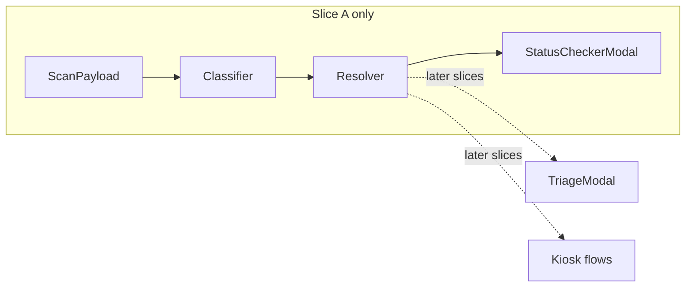

# Device refactor: kiosk, QR scan module, and triage/status modularity

**Status:** Active — design + phased implementation; **live status** in [§14](#14-implementation-status--remaining-backlog-2026-03-21) and [DEVICE_REFACTOR_PROGRESS.md](./DEVICE_REFACTOR_PROGRESS.md).  
**Stack context:** Laravel 12 + Inertia + Svelte 5 (see `.cursor/rules/stack-conventions.mdc`)  
**Related code (current):** `DeviceLock` includes `kiosk`; kiosk routes serve `Triage/PublicStart` with `DisplayLayout`; staff uses `qrScanResolve` + modals; display board scan removed from `Board.svelte`. **Still open:** idle attractor, admin-persisted `kiosk_*` keys, full kiosk↔staff resolver parity, Playwright.

---

## 1. Purpose and outcomes

This plan refactors **client-facing and staff-facing “devices”** so that:

1. **Responsibilities are separated** — queue display, staff workflows, and public self-service no longer share scanning UX in confusing places.
2. A new **physical kiosk** replaces the legacy **public triage page** as a first-class device type, with **program/site settings** that enable **self-service triage** and/or **status checking** independently.
3. **Staff triage** moves from a full page to a **modal** triggered like the **center QR button** on mobile admin/station layouts (mimicking the existing admin QR scanner pattern).
4. A **single modular QR pipeline** resolves scan payloads for **role** (staff / admin / supervisor / kiosk) and **intent** (authorize device vs resolve token vs route to triage vs show queue status).

**Non-goals in this document:** concrete API contracts, DB migrations, or file-by-file diffs — those belong in follow-up specs once this plan is approved.

---

## 2. Current state (as implemented today)

### 2.1 Device lock types (`app/Support/DeviceLock.php`)

| Constant | Value | Typical URL pattern | Role |
|----------|--------|---------------------|------|
| `TYPE_DISPLAY` | `display` | Per-site display board | Queue + announcements (**scan UI removed** from board per Phase 2) |
| `TYPE_TRIAGE` | `triage` | Legacy public-triage paths (301 → kiosk) | Legacy lock payload; new flows prefer `TYPE_KIOSK` |
| `TYPE_KIOSK` | `kiosk` | `/site/{site}/kiosk[/{program}]` | Public self-service (serves `Triage/PublicStart` today) |
| `TYPE_STATION` | `station` | Station board | Station-specific “now serving” view |

**Historical gap (resolved):** `TYPE_KIOSK` exists; legacy URLs redirect to kiosk. **Remaining:** see §14 (idle layer, admin `kiosk_*` persistence, resolver parity on kiosk).

### 2.2 The three “devices” in product language vs code

| Product name | Primary page(s) | Notes |
|--------------|-----------------|--------|
| **Display board** | `Display/Board.svelte` | Scan modal, HID focus loop, camera option, TTS — **heavy** |
| **Display station board** | `Display/StationBoard.svelte` | Station-scoped board |
| **Public triage** | `Triage/PublicStart.svelte` + program triage | Self-serve, device auth, program settings `allow_public_triage`, HID/camera toggles |

**Staff triage** lives at **`Triage/Index.svelte`** (authenticated), not under `DeviceLock` the same way — it is a **staff mobile** surface.

### 2.3 Key settings already in admin (program)

Examples from `Admin/Programs/Show.svelte` and backend program settings:

- `allow_public_triage` — enables `/public-triage` flows  
- `enable_public_triage_hid_barcode`, `enable_public_triage_camera_scanner`  
- Display board: `enable_display_hid_barcode`, `enable_display_camera_scanner`, `display_scan_timeout_seconds`  
- Staff triage: `staff_triage_allow_hid_barcode`, `staff_triage_allow_camera_scanner` (props on `Triage/Index.svelte`)

**Gap:** These flags are **split by surface** (display vs public triage vs staff). Public-triage-specific toggles **must become first-class `kiosk_*` program settings** (canonical names, admin grouping, persistence) so nothing is “implicitly” still tied to a removed page (see **§6**).

### 2.4 Status-after-scan today

`DisplayController` exposes status routes (e.g. `/site/{site}/display/status/{qr_hash}`) with props such as `display_scan_timeout_seconds`, HID/camera flags — used to align **auto-dismiss** with board scanner settings.

**Gap:** Staff triage and public triage duplicate **scan → lookup → bind/track** logic in different components. Display board navigates to status. The plan calls for a **shared “status checker” module** usable from kiosk, staff modal, and (where relevant) supervisor flows.

### 2.5 Admin / supervisor QR (mobile footer)

`StatusFooter.svelte` exposes a **center QR button** (`showQrButton`, `onQrClick`) for scan-to-approve style flows. Staff mobile layout composes this.

**Gap:** The plan asks for **parity of “scan UX”** (camera vs HID) with display board, but **routing after scan** must follow the **unified resolver** (§4), not a single hard-coded “approve” path.

---

## 3. Target device taxonomy

### 3.1 Four logical devices

| Device | Primary purpose | Auth model | Scanning |
|--------|-----------------|------------|----------|
| **Display board** | Queue + announcements (read-only **queue** UI) | Device PIN/QR lock | **Remove** inline scanning from this page (migrate elsewhere) |
| **Station board** | Station-scoped queue view | Same lock family as today | Typically **no** public scan-to-triage (confirm in spec); keep scope minimal unless product requires scan here |
| **Kiosk** (new) | Public: self-service triage and/or status check + **idle attractor** (video) | Device lock **or** kiosk-specific cookie (`kiosk` type) | **Yes** — primary scan entry |
| **Staff mobile** (no separate URL device type) | Program/station/tokens work | Laravel session | QR opens **modal** (not full-page triage) |

**Naming:**

- **Public triage** → **Self-service triage** (kiosk feature flag).  
- **Status checker** → explicit modular flow (token already in queue / status surface).

### 3.2 Remove / replace

| Remove or de-emphasize | Replacement |
|------------------------|-------------|
| Full-page **staff triage** route as the main entry | **Triage modal** from footer QR + program section entry points |
| **`/public-triage` as a standalone product surface** (long term) | **Kiosk route** with the same backend capabilities but clearer device semantics |
| **Scanning on display board** | Scanning on **kiosk** + **staff modal** + **status checker module**; display board settings that referred to scan **must be relocated** (§6) |

---

## 4. Unified architecture: QR Scan Module → Resolver → UI

This section is the **conceptual contract** for implementation.

### 4.1 Layers

```
┌─────────────────────────────────────────────────────────────────┐
│  QR SCAN MODULE (single entry)                                   │
│  - Captures raw payload (QR string, barcode, manual paste)       │
│  - Normalizes format (URL vs token id vs auth blob)              │
│  - Applies device + role context (kiosk settings, staff role)      │
└───────────────────────────┬─────────────────────────────────────┘
                            ▼
┌─────────────────────────────────────────────────────────────────┐
│  PAYLOAD CLASSIFIER                                               │
│  - Device authorization request? (PIN/QR approve flow)             │
│  - Token / session / registration QR?                            │
│  - Unknown / malformed                                           │
└───────────────────────────┬─────────────────────────────────────┘
                            ▼
┌─────────────────────────────────────────────────────────────────┐
│  ROLE + PRIVILEGE GATE                                            │
│  - Kiosk: only features enabled in Kiosk Settings                │
│  - Staff: triage vs status per resolver rules                    │
│  - Admin/Supervisor: auth + token resolution as today + plan     │
└───────────────────────────┬─────────────────────────────────────┘
                            ▼
┌─────────────────────────────────────────────────────────────────┐
│  TOKEN RESOLVER (queue state)                                     │
│  - Token not in queue / eligible → TRIAGE MODAL pipeline         │
│  - Token in queue / status-only → STATUS CHECKER MODAL           │
│  - Edge: deactivated, wrong program, identity policy blocks →    │
│    structured errors in modal                                      │
└───────────────────────────┬─────────────────────────────────────┘
                            ▼
┌─────────────────────────────────────────────────────────────────┐
│  UI: TriageModal | StatusCheckerModal | AuthApproveModal | …     │
└─────────────────────────────────────────────────────────────────┘
```

### 4.2 Decision matrix (use cases)

| Actor | Scan type | Resolver outcome | UI |
|-------|-----------|------------------|-----|
| **Kiosk** | Token QR | Not in queue (or allowed new entry) | **Self-service triage modal** (if enabled) |
| **Kiosk** | Token QR | In queue | **Status checker modal** (if enabled) |
| **Kiosk** | Token QR | Feature disabled | Message: “This kiosk is not configured for this action” |
| **Staff** | Token QR | Same as kiosk resolver | **Triage** or **Status** modal (no page navigation) |
| **Admin** | Auth / device QR | Authorization | Existing approve/consume flows |
| **Admin/Supervisor** | Token QR | May combine **auth** and **token resolution** per current product rules | Must not double-approve; **classifier runs first** |

**Gap:** Today, **admin QR** may assume “approve” semantics. The plan explicitly requires **payload classification before** choosing approve vs triage vs status — **spec and tests must list all QR formats** the system emits (token print QR, device auth QR, deep links).

### 4.3 “Resolver module” (frontend)

**Responsibilities:**

- Input: `rawScan`, `context` (`{ surface: 'kiosk' | 'staff_modal' | 'admin_modal' | 'display_board_deprecated', role, programId, settings }`)
- Output: discriminated union, e.g. `{ kind: 'triage', tokenId, ... } | { kind: 'status', tokenId, ... } | { kind: 'device_auth', ... } | { kind: 'error', code }`

**Reusability:** Same module for:

- Kiosk (after HID/camera capture)  
- Staff/supervisor **center QR** modal  
- Optional: automated tests with **fixture QR strings**

**Gap:** Backend may still need to **validate** token state; the resolver should **mirror** server rules to pick modal, but **server responses** are source of truth for security.

---

## 5. UI specifications by surface

### 5.1 Staff mobile: triage as modal (remove triage page as primary)

**Intent:**

- **Remove** the standalone **staff triage page** as the main workflow entry.
- **Replace** with a **modal** opened from:
  - **Center QR button** (same pattern as admin — `StatusFooter` + `onQrClick`)
  - Optional: **Program → Client registration** section (see §5.4)

**Behavior:**

- **Scan** mimics admin QR scanner: `ScanModal` / camera / HID per **staff triage settings** (relocate naming to “staff scan modal settings” if triage page goes away).
- **If token already in queue** → open **status checker modal** (shared module), not triage bind flow.
- **If not in queue** → **triage modal** content (extracted from current `Triage/Index.svelte` flows).

**Gaps / risks:**

- **Deep links** and bookmarks to `/triage` (or actual route name) — need **redirect** strategy or deprecation timeline.
- **Pending identity registrations** list today on triage page — must move to **program area** or **modal tab** so staff do not lose access.

### 5.2 Display board: strip scanning

**Intent:**

- Display board shows **queue + TTS + visuals** only; **no** `ScanModal` for token/status.
- **HID focus loop** and **local device toggles** that existed **only** for scanning may be **removed or reduced** — **must be documented** when moving scan to kiosk/staff.

**Settings note (critical):**

- Program settings today conflate **display_scan_timeout_seconds**, **enable_display_hid_barcode**, **enable_display_camera_scanner** with the **board** page.
- After refactor, either:
  - **Rename** to “legacy display scan” and hide when scanning removed, or  
  - **Migrate** relevant timeouts to **kiosk** + **staff modal** settings.

**Use cases to preserve (behaviors move, not deleted):**

- Visitor scans token to see status → **kiosk status checker** or **staff modal**.
- Staff used display board scanner in edge deployments → **migration note** in release notes.

### 5.3 Kiosk device (replaces public triage page)

#### 5.3.1 Layout: same chrome as display (header / footer rules)

The kiosk page should **feel like the same product** as the display board: shared **client-facing chrome**, not a one-off page.

| Area | Specification |
|------|----------------|
| **Layout component** | Reuse **`DisplayLayout.svelte`** (or a thin **`KioskPage.svelte`** wrapper that only composes `DisplayLayout` + kiosk-specific main slot). Same **`AppBackground`** (frosted wash + gradient stack), toaster, flash handling as other display routes. |
| **Header** | **Identical** to display: logo (locked vs link per `device_locked`), **program name** (Marquee / desktop), **date**, **live clock** — per existing `DisplayLayout` header. |
| **Base visual (always)** | **`AppBackground`** is the **hard fallback** for the full viewport: same **hero image + wash + gradient** used on **public site pages** and the rest of the app. When the kiosk controller shares **`heroImageUrl`** (or site-equivalent) with the layout — match **public pages**; when unset, use the **same default** as today (e.g. `AppBackground`’s default asset under `public/images/`). This layer stays **on** even when no kiosk video is configured. |
| **Main** | **Not** the queue grid. **Above** `AppBackground`: optional full-bleed **idle layer** (video / iframe / optional poster) when `kiosk_idle_media_url` is set and working; **scan affordances** and **modals** stack higher (z-index). Scroll behavior: prefer **no outer scroll** on idle state so the attractor feels like a full-screen display. |
| **Footer (public / device-locked)** | Match **public display board**: typically **no** staff nav bar. If the display board shows a minimal footer today, kiosk should mirror that; if display is header-only for anonymous users, kiosk matches. |
| **Footer (staff authenticated)** | When staff/admin opens the kiosk URL while logged in (setup, demo), **`DisplayLayout` already shows** the staff strip: nav bar + `StatusFooter` (program chip, QR if `can_approve_requests`, availability). Kiosk should **keep this** so behavior matches program/device pages. Update nav targets when `/triage` is deprecated (e.g. triage → modal entry or “Client registration”). |
| **Device lock** | Same **sessionStorage / navigation guard** semantics as display so the kiosk cannot wander off-site when locked. |

**Gap:** If `DisplayLayout` still imports **`ScanModal` for footer QR approve** only, kiosk page may need props to **hide display-only scan** while keeping staff QR — clarify in implementation so kiosk doesn’t duplicate two scan entry points.

#### 5.3.2 Parity with display board (interaction, not queue content)

- **HID-powered focus** every *N* seconds on a **hidden focus target** when `kiosk_enable_hid_barcode` is on (same pattern as `displayHid.js` + current `Board.svelte`).
- **Scan modal** (`ScanModal`): **camera** if `kiosk_enable_camera_scanner`; else HID / tap flow — aligned with former public triage + display scan UX.
- **Modals** (self-service triage, status checker): **auto-dismiss timer** from `kiosk_modal_idle_seconds` (or equivalent) so the kiosk returns to **idle attractor**.

#### 5.3.3 Idle attractor: background video / link handling (detailed)

**Goals:** Non-interactive **background** when no modal is open; **pause** (or mute) when any kiosk modal opens; **resume** when all modals close; **no** controls stealing focus from HID/camera prep.

**Configuration (stored in program settings; see §6):**

- `kiosk_idle_media_url` — string, optional. Single field can point to different **kinds** of sources; the **frontend classifies** the URL.

**Kind 0 — No idle media selected (default)**

- `kiosk_idle_media_url` is **empty / null** **or** admin never configured idle video: **do not** render a video or YouTube layer.
- The kiosk **main area is visually empty** (or holds only scan chrome); the user sees **only** the **global `AppBackground`** already rendered by `DisplayLayout` — i.e. the **same** background treatment as **all pages that use this layout** (site/public **hero image** when provided via shared props, otherwise the **default** hero image). This is the **hard fallback**: no separate “kiosk blank color” unless we add one later — **rely on AppBackground**.

**Kind A — Direct video file (recommended for reliability)**

- URL ends with or responds as **`.mp4` / `.webm`** (or `Content-Type: video/*`) from a **CORS-friendly** origin you control (CDN, static site, Laragon static).
- Render with **`<video>`**: `muted`, `playsInline`, `loop`, `object-fit: cover`, `pointer-events: none`, `aria-hidden="true"` for the decorative layer.
- **Optional “download then play locally” (frontend-only):** For **same-origin or CORS-allowed** direct files, the app may **`fetch()`** the asset, store in **Cache Storage** or **IndexedDB**, create an **`objectURL`**, and set `video.src` to the blob URL so repeat visits work **offline** or after **one** successful load. This is **not** applicable to YouTube watch URLs (see below).

**Kind B — YouTube (or other streaming page URL)**

- A **watch URL** (`youtube.com/watch`, `youtu.be/...`) is **not** a direct video file. Browsers cannot set `video.src` to YouTube and expect playback.
- **Default approach:** Detect host → render a **full-bleed `<iframe>`** (YouTube embed URL with `mute=1`, `loop=1` where supported, `controls=0`, `playsinline=1`). Style: fixed inset, `z-index` below modals, `pointer-events: none` so taps pass through to scan UI if needed — **or** a transparent overlay for scan only (product decision).
- **“Download then play from local path” for YouTube:** Relying on an **unofficial** client-side download of YouTube content is **fragile** and typically conflicts with **YouTube Terms of Service** and **CORS**. The plan treats this as **out of scope** unless the org uses **Google-approved** hosting (e.g. private file in Drive with embed API, or **self-hosted MP4**). Document for stakeholders: **YouTube = embed**, **MP4 URL = `<video>` or fetch-to-cache**.

**Kind C — Other page embeds (Vimeo, etc.)**

- Same as Kind B: **iframe embed** path, not `fetch` download, unless the vendor provides a **direct file URL**.

**Modal interaction (all kinds)**

| State | Video `<video>` | YouTube iframe |
|--------|------------------|----------------|
| Idle (no modal) | `play()` | postMessage or IFrame API: **play** |
| Modal open | `pause()` | **pause** |
| Modal closed | `play()` | **play** |
| Page hidden (optional) | pause to save CPU | pause |

**Failure behavior (ordered)**

1. **Hard fallback (always available):** **`AppBackground`** — same stack as public pages (`heroImageUrl` when shared from site/page props, else **default** image + wash + gradient). Visible whenever idle media is absent, not yet loaded, or failed.
2. **Optional:** `kiosk_idle_poster_url` — if set, show **on top of** `AppBackground` while video buffers or **briefly** on error (then hide poster and user sees **only** `AppBackground` again unless poster is kept as static attractor — product choice).
3. **No idle media URL:** skip layers 2+; user experience = **Kind 0** (background only).
4. **Invalid URL / network / embed blocked / YouTube API failure:** **remove or hide** the broken video/iframe layer; **do not** leave a black box — fall through to **(1)**. Header + program chrome remain.

**Gaps / decisions**

- **Both feature toggles off** (no triage, no status): idle-only kiosk — still show header + attractor; scan can show “self-service disabled” toast.
- **Audio:** Attractor should stay **muted** in public spaces unless product explicitly allows unmute (usually **muted** always).
- **Legal:** Stakeholders confirm rights for **looping** third-party YouTube content in a commercial kiosk setting.

#### 5.3.4 Kiosk settings (see §6 for canonical `kiosk_*` keys)

High-level toggles remain as previously discussed; **names and admin placement** are formalized in **§6**.

**Gaps:**

- **Device lock** — today `TYPE_TRIAGE` maps to public triage URL — introduce **`TYPE_KIOSK`** (or renamed route) in `DeviceLock` and device chooser (`DeviceTypeChoose.svelte`).

### 5.4 Program section: former “triage” area → **Client registration**

**Intent:**

- UI section previously labeled for triage navigation becomes **Client registration**, retaining **client registration** flows and links that already exist there.

**Gap:** Exact route names and **Admin/Programs/Show.svelte** tab structure need an inventory so nothing is orphaned when staff triage moves to modal.

---

## 6. Program settings: canonical `kiosk_*` keys (adopted from public triage)

Public triage behavior today is controlled by **program-level** flags in admin (`Admin/Programs/Show.svelte` and program settings persistence). When public triage is **removed as a page** and replaced by the **kiosk device**, those concerns must **not** linger under names like `allow_public_triage` — they become explicit **`kiosk_*`** settings so admins, API, and Inertia props stay readable.

### 6.1 Principles

1. **Namespace:** All kiosk-specific toggles use the prefix **`kiosk_`** on new canonical keys.
2. **Admin UI:** A dedicated **“Kiosk”** (or **“Kiosk device”**) subsection under Program settings — same visibility rules as today’s public triage block (e.g. only when site/program allows device features).
3. **Backend:** Program settings repository / JSON column: migrate legacy keys → `kiosk_*` with a **one-time migration** + **read fallback** (read old key if new key null during rollout).
4. **Inertia:** Kiosk page receives a single **`kiosk_settings`** object (or flattened props) built only from `kiosk_*` keys — no mixing with `enable_public_triage_*` in new code paths.

### 6.2 Proposed canonical keys (program scope)

| Key | Type | Purpose |
|-----|------|--------|
| `kiosk_self_service_triage_enabled` | bool | Former **`allow_public_triage`**: allow self-service triage flow on kiosk when resolver allows. |
| `kiosk_status_checker_enabled` | bool | Allow **status checker** modal when token is already in queue (split from “all-in-one” public triage). |
| `kiosk_enable_hid_barcode` | bool | Former **`enable_public_triage_hid_barcode`**. |
| `kiosk_enable_camera_scanner` | bool | Former **`enable_public_triage_camera_scanner`**. |
| `kiosk_modal_idle_seconds` | int (≥0) | Seconds until a kiosk modal auto-closes; `0` = no auto-close (discouraged on unattended hardware). Replaces ad hoc use of **`display_scan_timeout_seconds`** for kiosk-only flows. |
| `kiosk_hid_refocus_interval_ms` | int (optional) | If unset, reuse same default as display HID loop (e.g. 2000 ms). |
| `kiosk_idle_media_url` | string \| null | Single URL for attractor: **direct MP4/WebM** or **YouTube/watch URL** (see §5.3.3). |
| `kiosk_idle_poster_url` | string \| null | Optional image **above** `AppBackground` while video buffers or on transient error; if unset, **AppBackground alone** is enough. |
| `kiosk_idle_media_type` | enum \| null | Optional override if URL classification is ambiguous: `direct_video` \| `youtube_embed` \| `iframe_embed` \| `auto`. Default **`auto`** (frontend detects). |

**Identity / registration** settings that today say “when public triage is enabled…” should be reworded in admin copy to “when **kiosk self-service** is enabled…” and gated by **`kiosk_self_service_triage_enabled`** (and site policy).

### 6.3 Legacy → canonical mapping (migration)

| Legacy key (current / near-current) | Canonical `kiosk_*` key |
|-------------------------------------|-------------------------|
| `allow_public_triage` | `kiosk_self_service_triage_enabled` |
| `enable_public_triage_hid_barcode` | `kiosk_enable_hid_barcode` |
| `enable_public_triage_camera_scanner` | `kiosk_enable_camera_scanner` |
| *(new capability)* | `kiosk_status_checker_enabled` — backfill **true** if product wants parity with old “always show status when in queue,” or **false** and let admins enable explicitly. |

**Display-specific keys** (`enable_display_*`, `display_scan_timeout_seconds`) are **not** renamed to `kiosk_*`; they either **deprecate** with display scan removal or **split** into kiosk vs staff-only keys (see §6.4).

### 6.4 Non-kiosk settings that still change when display scan is removed

| Current setting | Today used on | After refactor |
|-----------------|---------------|----------------|
| `display_scan_timeout_seconds` | Display scan modal, status page dismiss | **Split:** `kiosk_modal_idle_seconds`, **`staff_scan_modal_idle_seconds`** (or reuse one global `scan_modal_idle_seconds` if product prefers), status route keeps its own dismiss prop if still a separate page. |
| `enable_display_hid_barcode`, `enable_display_camera_scanner` | Display board | **Remove** from display UI; **optional** migration: copy last values into **kiosk** and/or **staff** defaults once. |

### 6.5 Staff scan modal (not prefixed `kiosk_`)

Staff-specific flags remain **`staff_triage_*`** (or renamed to **`staff_scan_*`** in a separate bead) so **kiosk** and **staff** can differ: e.g. kiosk camera on, staff HID-only.

### 6.6 API / validation notes (planning)

- **Validation:** `kiosk_idle_media_url` — max length, allowed schemes (`https:` only in prod).
- **No server-side download of YouTube** in Phase 1; server stores **the string URL only**.
- **Feature matrix:** If `kiosk_self_service_triage_enabled` and `kiosk_status_checker_enabled` are both false, backend may still render kiosk page but returns **warnings** in admin save validation (soft) or **hard** validation — product choice.

---

## 6.7 Settings migration matrix (legacy summary)

| Legacy / current | Surface | Canonical / destination |
|------------------|---------|-------------------------|
| `allow_public_triage` | Public triage | `kiosk_self_service_triage_enabled` |
| `enable_public_triage_hid_barcode` | Public triage | `kiosk_enable_hid_barcode` |
| `enable_public_triage_camera_scanner` | Public triage | `kiosk_enable_camera_scanner` |
| `display_scan_timeout_seconds` | Display + status | Split per §6.4 |
| `enable_display_hid_*` / camera | Display board | Remove from display; seed kiosk/staff if needed |
| Staff triage HID/camera | `Triage/Index` | `staff_triage_*` or `staff_scan_*` |

---

## 7. Routes and backend touchpoints (inventory, not final spec)

| Area | Files / routes likely touched |
|------|-------------------------------|
| Device lock | `DeviceLock.php`, `PublicDeviceLockController`, middleware `EnforceDeviceLock` |
| Display | `DisplayController::display`, `Board` props (remove scan-related props over time) |
| Public triage | `publicTriageWithSite`, redirects — **replace with kiosk** routes |
| Staff triage | Controller serving `Triage/Index` — **modal-only** or redirect |
| API | Token lookup, session bind, status — reused by modular flows; avoid duplicating business logic in controllers |

**Gap:** New route names (`/site/{site}/kiosk/...`) vs reusing `public-triage` URLs for **backward compatibility** (301 redirects).

---

## 8. Phased delivery (suggested)

Phases (**0–4**) describe **sequential workstreams**. **Slices (A–E)** are **vertical cuts** through that work: each slice ends in a **named, testable outcome** so the first merge is not “foundation only” with no user-visible path. **Slice A** is the **recommended first test milestone** (the “pie slice”).

### 8.1 First vertical slice (recommended test milestone): Slice A — scan → status checker

| Field | Specification |
|-------|----------------|
| **Name** | **Slice A — Scan → status checker (shared module)** |
| **User-visible outcome** | A **staff** user (authenticated session) opens the **same scan affordance pattern** as today (prefer **center footer QR → modal**, per §5.1 and `StatusFooter.svelte`), completes **one** scan with a token that resolves to **already in queue**, and sees **token status** through the **extracted StatusChecker** UI. The flow uses **QR Scan Module → payload classifier → resolver** for the **staff + token-resolution** branch only. **Device authorization / approve** flows may be **deferred** within Slice A if that reduces delivery risk (classifier can return “not handled in Slice A” with clear UX). |
| **In scope** | Extract or isolate a **StatusChecker** presentation module; define **resolver output types** for “token in queue → show status”; reuse **existing** token/status APIs. Wire **one** integration point: **prefer** staff footer QR → modal; if blocked, document a **temporary feature flag** or staff-only route and remove it in Slice B. **No** new kiosk route, **no** `kiosk_*` migration, **no** display board scan removal in Slice A. |
| **Out of scope** | Kiosk device + `DeviceLock` type `kiosk`, **`kiosk_*` settings**, idle / YouTube / `AppBackground` layering beyond whatever the modal already uses, removing **`/public-triage`**, stripping **display board** scan UI, **triage modal** for “**not** in queue” (Slice B), full **admin/supervisor** authorize branching unless trivially shared. |
| **Verification** | **PHPUnit:** resolver pure functions (where applicable) + **feature test** for the status API path used by the modal. **Playwright** (per project quality gates): one happy path **open modal → inject or simulate scan payload → status UI visible**; if CI cannot drive HID/camera, document **manual** verification with hardware. |
| **Definition of done** | [ ] Shared **StatusChecker** module consumed by the integration point. [ ] **One** documented entry path (footer QR preferred). [ ] Tests green; no unrelated regressions. [ ] Resolver/classifier stubs or branches for non–Slice-A payloads do not crash (clear message or no-op). |

**Entry point preference:** Implement **staff footer QR → modal** first. If schedule or dependencies block it, use a **feature-flagged** or **temporary** staff-only surface **only** until Slice B, and list it in the PR / bead so it is not left permanent.



### 8.2 What not to do in Slice A (anti-scope)

- Do **not** add **`TYPE_KIOSK`**, kiosk routes, or kiosk program settings.
- Do **not** remove or redirect **public triage** URLs yet.
- Do **not** remove **display board** scanning or migrate `display_*` / `kiosk_*` scan settings in admin.
- Do **not** build **idle video**, **YouTube embed**, or **AppBackground**-specific kiosk layering.
- Do **not** implement the full **“not in queue → triage modal”** path; that is **Slice B** so Slice A stays thin.

### 8.3 Slice roadmap (A–E) and first testable moment

| Slice | Primary phase alignment | What you can test when the slice is done |
|-------|-------------------------|------------------------------------------|
| **A** | **0** (extract) + **start of 1** (wire status path) | **Status checker** end-to-end from staff scan entry (modal or agreed interim). |
| **B** | **1** (remainder) | **Triage modal** for **not in queue**; old triage page feature-flagged or secondary. |
| **C** | **2** | **Display board** has **no** scan UI; settings migrated per §6.4. |
| **D** | **3** | **Kiosk** route + device chooser + modals + idle media behavior. |
| **E** | **4** | **Public triage** removed or redirected; **`kiosk_*`** admin + legacy read-compat. |

### 8.4 Phases 0–4 with slice mapping

| Phase | Slice(s) | Scope | Verification |
|-------|----------|--------|--------------|
| **0 – Part 0** | **A** (foundation) | Extract **StatusChecker** + **TriageModal** **presentational** cores from existing pages; unit-level tests for resolver pure functions | Storybook or Svelte tests optional per project standards |
| **1** | **A** (status path) + **B** (triage path) | Staff: **modal** entry + resolver; **Slice A** delivers status branch first where possible; feature-flag old triage page | Manual + PHPUnit/API tests for token paths |
| **2** | **C** | Display board: **remove** scan UI; migrate settings | Playwright: board has no scan button |
| **3** | **D** | **Kiosk** page + `DeviceLock` type + device chooser UI | E2E: kiosk modal timers + video pause/resume |
| **4** | **E** | Remove or redirect **public triage**; admin settings rename | Regression on `allow_public_triage` semantics |

Dependencies: **Phase 1** should not require kiosk if resolver is feature-complete behind flags. **Slice A** should complete with a **testable status path** before **Slice B** expands resolver branches.

---

## 9. Edge cases and failure modes (must be test-scenarios)

1. **Scanner latch / flicker** — multiple scan callbacks (see `.cursor/rules/developing-gotchas.mdc`: latch pattern). **All** new modals must reuse one **scan latch** helper.
2. **Token in queue but triage-only kiosk** — show message vs status depending on **status checker** toggle.
3. **Token not in queue but status-only kiosk** — inverse.
4. **Supervisor scans device auth QR** — must not route to triage modal.
5. **Staff scans wrong program token** — resolver returns error modal with clear copy.
6. **Video fails to load** — hide broken layer; **hard fallback** to **`AppBackground`** (site hero or default); optional `kiosk_idle_poster_url` if configured; modal stack unchanged.
7. **HID focus loop + modal open** — pause HID refocus while modal visible (same as display board behavior today).

---

## 10. Non-functional requirements

- **Accessibility:** Modals trap focus; visible **Close**; timeout announced or visible countdown where feasible.
- **Performance:** Background video **muted**, **playsinline**, no user gesture requirement beyond autoplay policies — document browser constraints.
- **Security:** Kiosk remains **unauthenticated**; server must **not** expose staff-only actions on kiosk routes. **Rate limiting** on public token lookup endpoints (existing throttles).

---

## 11. Open questions (require product answers)

1. **Station board:** Should it ever expose scanning, or stay **read-only** like the main display board after refactor?
2. **Backward compatibility:** How long must `/public-triage` URLs work (301 to kiosk)?
3. **Idle media:** Is **YouTube iframe embed** sufficient for all “YouTube link” cases, or must the product require **offline** playback (implies **self-hosted MP4** + fetch-to-cache, not YouTube rip)?
4. **Admin/supervisor** token scan: Should **status** and **triage** be available to all roles that have the QR button, or gated?
5. **Identity / registration** flows that currently split across triage page and admin — **single “client registration” hub** definition for IA.
6. **`kiosk_status_checker_enabled` backfill:** Default **on** for existing programs (parity with old combined behavior) or **off** until explicitly enabled?

---

## 12. Success criteria (acceptance)

Status key: **Done** | **Partial** | **Open**

- **Partial** — **One** documented **QR Scan Module** interface (`qrScanResolve.js` + modals) and resolver-style outcomes used by **staff** modal + admin approve path; **kiosk** still uses **`PublicStart`** scan/bind logic, not the same discriminated-union module with `surface: 'kiosk'`.
- **Done** — Display board **does not** ship token scanning UI.
- **Partial** — Canonical **kiosk** routes + **301** from legacy public triage; **`kiosk_*` read** fallbacks in `ProgramSettings`. **Open:** admin writes **legacy** keys only; **no** DB migration writing **`kiosk_*`**.
- **Partial** — Program admin still labels/edits **`allow_public_triage`** / public triage HID/camera; **read-compat** documented via getters. **Open:** dedicated **Kiosk** subsection + persisted **`kiosk_*`** keys.
- **Partial** — Kiosk uses **`DisplayLayout`** + same header/chrome as other display routes (`Triage/PublicStart`). **Open:** dedicated **`KioskPage`** wrapper only if product wants a thinner shell; **idle** layer not built.
- **Open** — Independent **`kiosk_self_service_triage_enabled`** vs **`kiosk_status_checker_enabled`** on **backend + Inertia** (getters exist); **frontend** must still gate flows in **`PublicStart`** (props not fully wired). **Open:** **`kiosk_idle_media_url`** / poster / type in settings + **pause/resume** attractor per §5.3.3.
- **Partial** — Staff triage primary UX is **modal** when triage page disabled; **legacy** `/triage` behind flag. **Open:** **pending identity registrations** list when triage page off (§5.1); **Client registration** IA cleanup in admin program UI.
- **Partial** — PHPUnit covers redirects, device lock, program settings getters, triage/kiosk routes; **Open:** Playwright for staff scan happy path; resolver edge cases per §9 on **kiosk** surface.

---

## 13. Document history

| Date | Change |
|------|--------|
| 2025-03-21 | Initial plan; follow-up: **`kiosk_*` program settings** (§6), **DisplayLayout** shell parity (§5.3.1), idle media **direct MP4 / YouTube embed / optional fetch-to-cache** (§5.3.3) |
| 2025-03-21 | Idle attractor **Kind 0** + **hard fallback** to **`AppBackground`** (site hero or default) when no video / failure (§5.3.1, §5.3.3) |
| 2025-03-21 | **§8:** First vertical **Slice A** (scan → status checker), **§8.2** anti-scope, slice roadmap **A–E**, phase table with slice mapping, optional mermaid for Slice A |
| 2026-03-21 | **Progress:** See [DEVICE_REFACTOR_PROGRESS.md](./DEVICE_REFACTOR_PROGRESS.md) — Phase 1 closure (no Playwright), `/triage` redirect preserves query; Phase 2: display board scan UI removed from `Board.svelte`. |
| 2026-03-21 | **Phase 3 (partial):** `TYPE_KIOSK`, `/site/{site}/kiosk/...`, `kiosk_*` getters with legacy fallback; 301 from `/public-triage` to kiosk; device chooser uses `kiosk`. |
| 2026-03-21 | **§12** reframed as Done/Partial/Open; **§14** added — implementation audit, robustness checklist, prioritized backlog. |

---

## 14. Implementation status & remaining backlog (2026-03-21)

Companion narrative: [DEVICE_REFACTOR_PROGRESS.md](./DEVICE_REFACTOR_PROGRESS.md). This section is the **single checklist** for “what’s left” against the original vision (§1–§12).

### 14.1 Completed (verified in codebase)

| Item | Notes |
|------|--------|
| Staff scan → resolver → modals | `qrScanResolve` + `StatusCheckerModal` / `StaffTriageBindModal` from footer QR (`MobileLayout` / `StatusFooter`). |
| Feature-flagged staff triage page | `FEATURE_STAFF_TRIAGE_PAGE` / `staff_triage_page_enabled`; redirect **`/triage` → `/station`** preserves **`?program=`**. |
| Display board scan removed | `Board.svelte` — no `ScanModal`, HID loop, or “check status” scan entry; copy points to kiosk/staff. |
| `TYPE_KIOSK` + routes | `/site/{site}/kiosk`, `/site/{site}/kiosk/{program_slug}`; cookie/lock parsing allows `kiosk`. |
| Legacy URL compatibility | **301** from `/public-triage`, site public-triage routes, `/public/triage/{program}` → kiosk URLs where implemented. |
| `ProgramSettings` kiosk getters | `getKioskSelfServiceTriageEnabled`, `getKioskStatusCheckerEnabled`, `getKioskEnableHidBarcode`, `getKioskEnableCameraScanner`, `getKioskModalIdleSeconds` with **legacy fallbacks** (see `ProgramSettingsTest::test_kiosk_getters_fallback_to_legacy_keys`). |
| Device chooser + middleware | `DeviceTypeChoose` posts **`kiosk`**; `EnforceDeviceLock` / `PublicDeviceLockController` understand kiosk paths and triage→kiosk transitions. |
| Kiosk shell | `Triage/PublicStart.svelte` uses **`DisplayLayout`** (§5.3.1 base chrome met; idle video layer not). |

### 14.2 Partial / in progress

| Item | Gap to close |
|------|----------------|
| **Unified QR module on kiosk** | Staff uses **`qrScanResolve`**; kiosk **`PublicStart`** still owns scan/bind/status branching. **Target:** one module with `surface: 'kiosk' \| 'staff_modal'` and shared §4 output types. |
| **`kiosk_status_checker_enabled` (and self-service) in UI** | Getters + some Inertia props exist; **`PublicStart`** does not yet consistently branch on **`kiosk_status_checker_enabled`** for “in queue → status only” vs §9 scenarios 2–3. Confirm and wire. |
| **Display admin settings** | **`enable_display_hid_*`**, **`display_scan_timeout_seconds`** may still appear for programs where display scan is gone — **hide or migrate** per §6.4. |
| **Staff modal idle** | Plan §6.4 split **`staff_scan_modal_idle_seconds`** (or reuse one global) — not implemented as distinct from **`kiosk_modal_idle_seconds`** fallback chain. |
| **Slice A verification** | PHPUnit/API coverage exists for several paths; **Playwright** for staff scan flow **deferred** (documented in progress file). |
| **Admin/supervisor QR classifier** | §4.2 “classify before approve” — staff path improved; **full matrix** + documented QR formats still **open** (§11 lacks concrete spec list). |

### 14.3 Not started (explicit backlog)

| Priority | Work | Plan refs |
|----------|------|-----------|
| P0 | **Admin UI + persistence:** dedicated **Kiosk** subsection; save **`kiosk_*`** keys; **one-time migration** legacy → `kiosk_*` (§6.3, §8 Slice E). | §6, §12 |
| P0 | **`PublicStart` (or split component):** enforce **feature matrix** (self-service vs status-only vs both off) using getters/props; align copy with §9 cases 2–3. | §5.3, §9 |
| P1 | **Idle attractor:** `kiosk_idle_media_url`, `kiosk_idle_poster_url`, `kiosk_idle_media_type` in **settings + getters**; UI: Kind 0–C, pause/resume with modals, failure → `AppBackground` (§5.3.3). | §5.3.3, §12 |
| P1 | **Optional `KioskPage.svelte`** — thin wrapper if `PublicStart` grows too large; not required if structure stays clear. | §5.3.1 |
| P1 | **Pending identity registrations** when staff triage **page** is disabled — surface on **Station** or program modal (§5.1). | §5.1 |
| P2 | **Program admin IA:** “Client registration” labeling and tab inventory; no orphaned triage links (§5.4). | §5.4 |
| P2 | **Documented QR format catalog** + tests for admin/supervisor/device/token payloads (§4.2). | §4 |
| P2 | **Playwright:** staff scan happy path; optional kiosk smoke after resolver merge. | §8.1, quality gates |
| P3 | **Station board scanning** — product answer §11.1; implement only if “yes.” | §11 |
| P3 | **`staff_triage_*` → `staff_scan_*`** rename bead (§6.5) — cosmetic/consistency. | §6.5 |

### 14.4 Robustness & verification checklist

Use before closing Phase 4 or a release candidate:

- [ ] All **`kiosk_*`** getters covered by **PHPUnit** when migration adds DB columns/JSON keys (extend `ProgramSettingsTest`).
- [ ] **301** targets and **lock** enforcement retested after route changes (`PublicTriageTest`, `DisplayBoardTest`, device lock tests).
- [ ] **No duplicate scan entry** on kiosk: staff footer QR vs kiosk HID/camera — product-intent documented (§5.3.1 gap).
- [ ] **Rate limits** still applied on public token lookup endpoints (§10).
- [ ] **Accessibility:** modals — focus trap, close, timeout visibility (§10) — spot-check when idle layer lands.
- [ ] **Playwright** revisited when staff E2E is no longer deferred.
