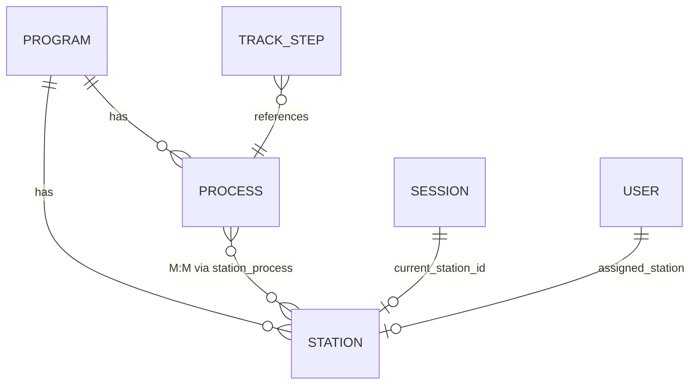

# Process-Station Refactor Specification

**Purpose:** Authoritative specification for introducing the Process entity and Station-Process many-to-many model into FlexiQueue. This document is the source of truth for task decomposition and implementation.

**Status:** Phase 1 complete. Phase 2 and 3 pending.

### Implementation Progress

| Phase | Status | Bead | Notes |
|-------|--------|------|-------|
| **Phase 1** | Done | flexiqueue-6rt (closed) | Migrations: `processes`, `station_process`, `track_steps.process_id` + backfill. Models: Process, Station.processes(), TrackStep.process(), Program.processes(), Program.getStationSelectionMode(). All existing track steps backfilled via station name → process. `station_id` kept for dual-read. |
| **Phase 2** | Done | flexiqueue-hde (closed) | FlowEngine, StationSelectionService, SessionService wiring; station_selection_mode in program settings |
| **Phase 3** | Pending | flexiqueue-tpb | Drop station_id from track_steps, Step CRUD process_id (depends on flexiqueue-hde) |

**Cases to be worked on / adjusted in higher-level plan:**
- `track_steps.process_id` left nullable for SQLite test compatibility; Phase 3 migration will enforce NOT NULL when dropping `station_id`
- Station create/update validation ("every station ≥1 process") not yet enforced — defer to Phase 2/3 when Process CRUD UI exists

---

## 1. Executive Summary

### 1.1 Current Model

- **TrackStep** references **Station** (1:1): `track_steps.station_id`
- **Session** has `current_station_id` — always a concrete station
- **FlowEngine.calculateNextStation()** returns `{ station_id, step_order }` — deterministic, one station per step
- **Staff** is assigned to exactly one station per program via `ProgramStationAssignment`

### 1.2 Target Model

- **TrackStep** references **Process** (1:1): `track_steps.process_id`
- **Process** and **Station** are many-to-many via `station_process` pivot
- **Session.current_station_id** remains — sessions always queue at a concrete station
- **Dynamic queue manager:** When a process has 2+ stations, the system selects which station receives the next client via a configurable algorithm
- **Staff** remains 1 station per program (unchanged)

### 1.3 Rationale

- **Flexibility:** Multiple stations can handle the same logical process (e.g., two Verification desks for one "Verification" process)
- **Load balancing:** Queue manager decides where to route clients for better utilization
- **Productive worker:** Algorithms like `least_busy` and `least_recently_served` keep staff productive
- **Configurable flow management:** `station_selection_mode` allows tuning of routing behavior

---

## 2. Data Model

### 2.1 New Tables

#### `processes`

| Column | Type | Nullable | Default | Notes |
|--------|------|----------|---------|-------|
| `id` | BIGINT UNSIGNED | NO | AUTO_INCREMENT | PK |
| `program_id` | BIGINT UNSIGNED | NO | — | FK → programs.id ON DELETE CASCADE |
| `name` | VARCHAR(50) | NO | — | e.g., "Verification", "Cash Release" |
| `description` | TEXT | YES | NULL | Optional |
| `created_at` | TIMESTAMP | NO | CURRENT_TIMESTAMP | |
| `updated_at` | TIMESTAMP | NO | CURRENT_TIMESTAMP | |

**Constraints:**
- UNIQUE (`program_id`, `name`) — no duplicate process names within a program

#### `station_process` (pivot)

| Column | Type | Nullable | Notes |
|--------|------|----------|-------|
| `station_id` | BIGINT UNSIGNED | NO | FK → stations.id ON DELETE CASCADE |
| `process_id` | BIGINT UNSIGNED | NO | FK → processes.id ON DELETE CASCADE |

**Constraints:**
- UNIQUE (`station_id`, `process_id`)
- Composite primary key or unique index

### 2.2 Schema Changes

#### `track_steps`

- **Add:** `process_id` BIGINT UNSIGNED nullable (during migration), then NOT NULL
- **Deprecate then remove:** `station_id` — phased out after cutover

#### Unchanged

- `queue_sessions.current_station_id` — sessions always reference concrete station
- `queue_sessions.override_steps` — remains `[station_id, ...]` JSON
- `permission_requests.custom_steps` — remains `[station_id, ...]` JSON
- `transaction_logs.station_id`, `previous_station_id`, `next_station_id` — all stay station-based

### 2.3 Constraints and Invariants

| Constraint | Enforcement |
|------------|-------------|
| Every **station** MUST have at least one process | Application: block station create/update if processes array empty; migration backfills existing stations |
| Process MAY have 0 stations | Allowed; routing fails at bind/transfer with "no stations" message (config error omitted per user) |
| Track step process must belong to program | Form request: validate process.program_id === track.program_id |
| Staff assignment | Unchanged: 1 station per program |

---

## 3. Entity Relationship Diagram



---

## 4. Flow Logic Changes

### 4.1 FlowEngine

**Current:** `calculateNextStation(Session $session): ?array{ station_id, step_order }`

**Target:** Returns `?array{ process_id, step_order }` when using track steps.

**Behavior:**
- When `session.override_steps` is set: path remains station-based; return `{ station_id, step_order }` (override_steps are concrete station IDs)
- When using track steps: load next `TrackStep` by `step_order`, return `{ process_id: $nextStep->process_id, step_order }`
- If next step's process has no active stations: return null (caller handles)
- If next step does not exist: return null (flow complete)

**Dual-read period:** When `process_id` is null on TrackStep, fall back to `station_id` for backward compatibility.

### 4.2 StationSelectionService (New)

**Method:** `selectStationForProcess(int $processId, int $programId, ?array $context = null): ?int`

Returns `station_id` or null if no candidate station.

**Algorithms (driven by `program.settings.station_selection_mode`):**

| Mode | Description | Implementation |
|------|-------------|----------------|
| `fixed` | Single station → use it; multiple → treat as `shortest_queue` | If 1 candidate, return it; else run shortest_queue |
| `shortest_queue` | Station with fewest waiting (waiting + called + serving) | Count sessions per station, pick min |
| `least_busy` | Station with fewest total (waiting + serving) — "productive worker" | Same as shortest_queue for now; can add serving weight |
| `round_robin` | Rotate by last assignment | TransactionLog scan or stored last_station_id per process |
| `least_recently_served` | Station that received a client longest ago | TransactionLog scan: last transfer/arrival per station |

**Input filtering:**
- Only stations where `is_active = true`
- Only stations in `station_process` for this process
- Optional (future): exclude stations where all assigned staff are `on_break` or `away`

### 4.3 SessionService Touchpoints

| Operation | Change |
|-----------|--------|
| **bind** | First step: `process_id` → `StationSelectionService::selectStationForProcess()` → `current_station_id`; fail if null |
| **transfer (standard)** | FlowEngine returns `process_id` → `StationSelectionService::selectStationForProcess()` → target station; fail if null |
| **transfer (custom)** | Unchanged: `target_station_id` provided directly |
| **override** | Unchanged: `target_station_id` provided directly |
| **overrideByTrack** | Unchanged: first step `station_id` (during transition) or first step `process_id` → StationSelectionService |
| **reassignToTrack** | Same as overrideByTrack: resolve first station via process |
| **reassignToCustomPath** | Unchanged: `stationIds` provided directly |
| **resolveStepOrderForTarget** | When target station is in a process: find TrackStep where `process_id` matches station's process; when override_steps, resolve by index in array |

---

## 5. Program Settings Extension

### 5.1 New Setting: `station_selection_mode`

Add to `programs.settings` JSON:

```json
{
  "station_selection_mode": "fixed" | "shortest_queue" | "least_busy" | "round_robin" | "least_recently_served"
}
```

**Default:** `fixed` — when process has 1 station, use it; when N stations, default to `shortest_queue`.

**Program model:** Add `getStationSelectionMode(): string`.

---

## 6. Complete File Touchpoint Matrix

| Layer | File | Change |
|-------|------|--------|
| Migration | `database/migrations/YYYY_MM_DD_create_processes_table.php` | New |
| Migration | `database/migrations/YYYY_MM_DD_create_station_process_table.php` | New |
| Migration | `database/migrations/YYYY_MM_DD_add_process_id_to_track_steps.php` | Add process_id, backfill from station_id |
| Migration | (later) `database/migrations/YYYY_MM_DD_drop_station_id_from_track_steps.php` | After validation |
| Model | `app/Models/Process.php` | New |
| Model | `app/Models/Station.php` | belongsToMany(Process), validation: at least 1 process |
| Model | `app/Models/TrackStep.php` | process_id, process(), keep station() during transition |
| Model | `app/Models/ServiceTrack.php` | (indirect via TrackStep) |
| Model | `app/Models/Program.php` | hasMany(Process), getStationSelectionMode() |
| Service | `app/Services/FlowEngine.php` | Return process_id; override_steps path station-based |
| Service | `app/Services/StationSelectionService.php` | New: selectStationForProcess |
| Service | `app/Services/SessionService.php` | bind, transfer use StationSelectionService |
| Controller | `app/Http/Controllers/Api/Admin/StepController.php` | CRUD: process_id instead of station_id |
| Controller | `app/Http/Controllers/Api/Admin/ProcessController.php` | New: CRUD processes |
| Controller | `app/Http/Controllers/Admin/ProgramPageController.php` | Pass processes, station-process assignments |
| Request | `StoreTrackStepRequest`, `UpdateTrackStepRequest` | process_id validation |
| Request | `StoreProcessRequest`, `UpdateProcessRequest` | New |
| UI | `resources/js/Pages/Admin/Programs/Show.svelte` | Process management; step modal: process select |
| UI | `resources/js/Components/FlowDiagram.svelte` | Use process name; show stations per process |
| Policy | `StationPolicy`, `SessionPolicy` | No change |
| Queue | `StationQueueService` | No change |
| Display | `DisplayBoardService` | No change |
| Dashboard | `DashboardService` | No change |
| Tests | `FlowEngineTest`, `SessionBindTest`, `SessionActionsTest`, `StepControllerTest`, etc. | Update assertions |

---

## 7. Edge Cases (Exhaustive)

| # | Scenario | Behavior | Where Enforced |
|---|----------|----------|----------------|
| 1 | Process has 1 station | Use that station (fixed) | StationSelectionService |
| 2 | Process has 2+ stations | Run station_selection_mode algorithm | StationSelectionService |
| 3 | Process has 0 stations | No config error (omitted per user) | — |
| 4 | Station has 0 processes | INVALID: block save | StationController, StoreStationRequest, UpdateStationRequest |
| 5 | Station is inactive | Exclude from StationSelectionService candidates | StationSelectionService |
| 6 | All candidates inactive | Return null; SessionService fails with "No next station" | FlowEngine, SessionService |
| 7 | Track step references process not in program | Reject at step create/update | StoreTrackStepRequest, UpdateTrackStepRequest |
| 8 | Override to station not in session's next process | Allow (override bypasses process) | Unchanged |
| 9 | override_steps: [station_id, ...] | Unchanged; remains station-based | FlowEngine.calculateNextFromOverrideSteps |
| 10 | Custom path: first station inactive | Reject | SessionService.reassignToCustomPath |
| 11 | Bind: first process has 0 stations | Fail "Track first step has no stations" | SessionService.bind |
| 12 | Transfer: next process has 0 stations | Fail "No next station available" | SessionService.transfer |
| 13 | Staff availability (on_break, away) | Optional filter (future) | StationSelectionService |
| 14 | Round-robin: last-assigned per process | TransactionLog or process-level state | StationSelectionService |
| 15 | Least-recently-served | TransactionLog scan | StationSelectionService |
| 16 | Delete process in use by track steps | Block | ProcessController.destroy |
| 17 | Delete station with sessions | Block (existing) | StationController.destroy |
| 18 | Program activation: validate processes | Omit (no config error) | — |
| 19 | Step reorder: contiguous step_order | Unchanged | StepController |
| 20 | Transaction logs: station_id | Unchanged | All services |
| 21 | New station: must assign ≥1 process before save | Block | Station create/update |
| 22 | Remove last process from station | Block | Station update |
| 23 | Process used in track: prevent delete | Block | ProcessController |

---

## 8. Migration Strategy

### Phase 1 — Additive

1. Create `processes` table
2. Create `station_process` table
3. Add `track_steps.process_id` (nullable)
4. Backfill: for each distinct `track_steps.station_id`, create process with station name (or use existing by name), link station to process in `station_process`
5. Backfill `track_steps.process_id` from station's process
6. Make `process_id` NOT NULL after backfill
7. Keep `track_steps.station_id` for now

### Phase 2 — Dual-Read and StationSelectionService

1. Add `station_selection_mode` to program settings (default: `fixed`)
2. Implement `StationSelectionService`
3. FlowEngine: when `process_id` present, return process_id; else fall back to station_id
4. SessionService: wire StationSelectionService for bind and transfer (standard mode)
5. All override paths remain station-based

### Phase 3 — Cutover

1. Ensure all track steps have `process_id`
2. Remove FlowEngine fallback to station_id
3. Step CRUD: require process_id, remove station_id from API
4. Migration: drop `track_steps.station_id`

---

## 9. API Spec Changes

### 9.1 Process Endpoints (New)

| Method | Path | Description |
|--------|------|-------------|
| GET | `/api/admin/programs/{program}/processes` | List processes |
| POST | `/api/admin/programs/{program}/processes` | Create process |
| PUT | `/api/admin/programs/{program}/processes/{process}` | Update process |
| DELETE | `/api/admin/programs/{program}/processes/{process}` | Delete (block if in use) |

### 9.2 Station-Process Assignment

| Method | Path | Description |
|--------|------|-------------|
| GET | `/api/admin/programs/{program}/stations/{station}/processes` | List processes for station |
| PUT | `/api/admin/programs/{program}/stations/{station}/processes` | Set processes (body: `{ process_ids: [1,2,3] }`); must have ≥1 |

### 9.3 Step API Changes

| Change | Before | After |
|--------|--------|-------|
| Create body | `station_id`, ... | `process_id`, ... |
| Update body | `station_id`, ... | `process_id`, ... |
| Response | `station_id`, `station_name` | `process_id`, `process_name`; optionally `stations` (array) for display |

### 9.4 Program Settings

Add `station_selection_mode` to `PUT /api/admin/programs/{id}` settings object.

---

## 10. UI Spec Changes

### 10.1 Programs Show Page

- **New "Processes" tab or section:** CRUD processes (name, description)
- **Stations section:** When creating/editing station, multi-select processes (every station must have ≥1)
- **Track steps modal:** Select process (dropdown) instead of station; show "Stations: A, B" when process has multiple stations
- **FlowDiagram:** Render process names on nodes; optionally show stations underneath

### 10.2 Validation Messages

- "Station must have at least one process"
- "Track first step has no stations" (bind)
- "No next station available" (transfer)

---

## 11. Test Matrix

| Test | Scope | Focus |
|------|-------|-------|
| FlowEngine with process_id | Unit | Returns process_id; null when complete |
| FlowEngine override_steps | Unit | Unchanged; station-based |
| StationSelectionService fixed | Unit | 1 station → that station |
| StationSelectionService shortest_queue | Unit | Picks station with fewest waiting |
| StationSelectionService round_robin | Unit | Rotates correctly |
| StationSelectionService least_recently_served | Unit | Picks station longest since last client |
| Bind routes to correct station | Feature | 1 and N stations |
| Transfer routes to correct station | Feature | Standard mode |
| Override unchanged | Feature | Custom station still works |
| Step CRUD with process_id | Feature | Create, update, delete |
| Station must have ≥1 process | Feature | Reject station with 0 processes |
| Process in use blocks delete | Feature | Process with track steps |

---

## 12. Documentation Updates (Post-Implementation)

- **04-DATA-MODEL.md:** Add Process, station_process; update TrackStep, relationship summary
- **03-FLOW-ENGINE.md:** Process-based routing; StationSelectionService pseudocode
- **08-API-SPEC-PHASE1.md:** Process endpoints; step request/response; station_selection_mode
- **09-UI-ROUTES-PHASE1.md:** Process management routes and pages

---

## 13. Expansion Points (Future)

- Per-process `station_selection_mode` override
- Staff availability in station selection (exclude stations with all staff on break)
- Process capacity or weight on `station_process` pivot
- Analytics: process-level wait times aggregated across stations
- Display board: optional process-level view (sessions per process)

---

## 14. Task Decomposition Checklist

Beads: Phase 1 = flexiqueue-6rt (closed); Phase 2 = flexiqueue-hde; Phase 3 = flexiqueue-tpb.

Use this checklist when creating beads or tickets:

- [x] Migration: create processes table
- [x] Migration: create station_process table
- [x] Migration: add process_id to track_steps, backfill
- [x] Model: Process
- [x] Model: Station belongsToMany Process (validation deferred to Phase 2/3)
- [x] Model: TrackStep process_id, process()
- [x] Model: Program hasMany Process, getStationSelectionMode
- [x] Service: StationSelectionService
- [x] Service: FlowEngine process_id return
- [x] Service: SessionService bind/transfer wiring
- [x] Program settings: station_selection_mode (UpdateProgramRequest, API, UI)
- [ ] Controller: ProcessController CRUD
- [ ] Controller: StepController process_id
- [ ] Controller: StationController process assignment
- [ ] Request: StoreProcessRequest, UpdateProcessRequest
- [ ] Request: StoreTrackStepRequest, UpdateTrackStepRequest process_id
- [ ] UI: Processes tab/section
- [ ] UI: Station process multi-select
- [ ] UI: Step modal process select
- [ ] UI: FlowDiagram process display
- [ ] Tests: Unit and feature per matrix
- [ ] Migration: drop station_id from track_steps (Phase 3)
- [ ] Docs: 04, 03, 08, 09 updates
