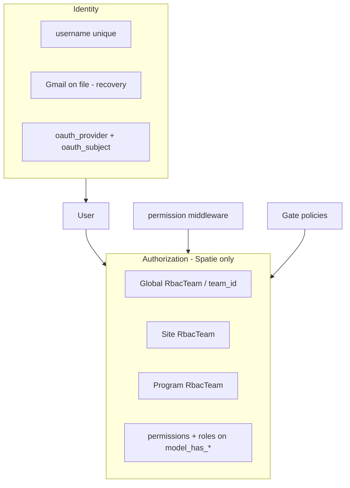

# RBAC + identity: end-state architecture (standard, scalable, low technical debt)

| | |
|---|---|
| **Status** | **Draft / north-star** — implementation is phased; do not treat this as fully shipped until phases below are marked done. |
| **Replaces / complements** | [`RBAC_SPATIE_PERMISSIONS_MIGRATION_PLAN.md`](RBAC_SPATIE_PERMISSIONS_MIGRATION_PLAN.md) (Phases 0–6 shipped), [`PERMISSIONS-TEAMS-AND-UI.md`](../architecture/PERMISSIONS-TEAMS-AND-UI.md) (scoped teams), [`RBAC_POLICY_CLEANUP.md`](RBAC_POLICY_CLEANUP.md) (post–Phase 6 cleanup). **Identity / login / onboarding:** canonical spec is [`HYBRID_AUTH_ADMIN_FIRST_PRD.md`](HYBRID_AUTH_ADMIN_FIRST_PRD.md) — this file defers to it for OAuth, mail, and provisioning UX. |
| **Audience** | Architects and leads prioritizing **one authorization story** (Spatie end state), **admin-first identity** (see hybrid PRD), and **no long-lived dual-write** between enum/pivot and Spatie. |

---

## 1. Problem statement

Today’s FlexiQueue authorization stack is **correct for a phased migration** but carries **ongoing complexity**:

- **`users.role` enum** (admin API / forms) and Spatie **global-team roles** stay aligned via **`SpatieRbacSyncService`** when **`UserProvisioningService`** runs (after create, or when `role` / `username` / `password` change).
- **Supervisors** are **`programs.supervise` on each program’s `RbacTeam`**; staff supervisors may still get **global** direct `dashboard.view` / `auth.supervisor_tools` from **`syncSupervisorDirectPermissions`** until that is narrowed to program-context-only checks.
- **Spatie teams** + **`RbacTeam`** exist for **site/program** dynamics, parallel to the legacy supervisor path.

That is **maintainable** but **not** the long-term “standard” shape: two sources of truth for identity/authorization create **drift risk**, extra code paths, and harder reasoning for new features.

**This document defines the target end state** and **phased work** to get there without pretending we can flip everything in one day.

### 1.1 Pre-production: aggressive cleanup is allowed (scalability now)

While FlexiQueue is **still in active development** without production data to preserve — or when a **full DB reset / `migrate:fresh` + seed** is acceptable — the team **may skip long “bridge” periods** and **land the end-state shape faster**:

| Area | What you can do |
|------|------------------|
| **Schema / migrations** | **Bolder** changes in fewer steps: drop legacy tables/columns (`program_supervisors`, redundant enum-only paths, etc.), add replacement structures (**program `RbacTeam`**, **`credentials`** per [`HYBRID_AUTH_ADMIN_FIRST_PRD.md`](HYBRID_AUTH_ADMIN_FIRST_PRD.md)) in **one cut** where safe. |
| **Dual-write** | **Shorten or omit** extended periods where `users.role` and Spatie must stay perfectly synced — migrate data **once**, fix seeders and PHPUnit, move on. |
| **Risk trade-off** | You trade **zero-downtime, incremental** rollout for **breaking changes** acceptable only while **no external tenants** depend on old rows. |

The **R1–R6** phases below remain the **safe playbook** for **production** or **long-lived shared databases**. Use **§1.1** when your risk profile allows **speed and a clean schema** over **gradual coexistence**.

---

## 2. Principles (non-negotiable for “end state”)

1. **Single source of truth for authorization**  
   **Spatie** permissions, roles, and **team-scoped** assignments (`RbacTeam` / `team_id`) are authoritative. **HTTP routes** and **policies** use **`$user->can()`** and **`hasPermissionInContext`** (or equivalent) — not parallel `isAdmin()` / enum checks for new code.

2. **Product identity vs authorization**  
   “Who is this person?” may use **username** (local login), **Gmail on file** (recovery), **OAuth subject** (`google_id`), etc. **What they may do** is **only** expressed through Spatie (global + site + program teams as designed).

3. **No silent dual-write**  
   Observers that “fix up” Spatie after every save are a **bridge**, not the destination. The end state is **explicit services** that assign/revoke roles and permissions in **one transaction** when domain events happen (user invited, site changed, supervisor assigned).

4. **Supervisor = scoped assignment, not a secret side channel**  
   Program supervision should be expressed as **program `RbacTeam`** grants (roles and/or permissions), **not** a pivot + global direct permission sync that must stay in sync.

5. **Identity vs access (see hybrid PRD)**  
   **Local username/password** (via **`credentials`** row) remains a first-class path; **Google** is optional after linking. **Outbound mail** for resets: **Agila/Hestia SMTP** per hybrid PRD **§0.2**. **Admins** provision users — **no** public registration. Details: [`HYBRID_AUTH_ADMIN_FIRST_PRD.md`](HYBRID_AUTH_ADMIN_FIRST_PRD.md).

---

## 3. Target architecture (RBAC)

| Layer | End-state rule |
|-------|----------------|
| **Catalog** | Stable `PermissionCatalog` names; new capabilities = new names + migration/seeder. |
| **Roles** | Spatie roles (`admin`, `staff`, `super_admin`, …) **or** fine-grained roles per product — but **not** duplicated as an enum used for authorization. |
| **Site/program scope** | **`RbacTeam`** is the only `team_id` Spatie sees; never raw `sites.id` / `programs.id`. |
| **Supervisor** | `programs.supervise` (and related) granted **on program `RbacTeam`** for the right users; **pivot removed** once parity tests pass. |
| **Sync service** | **Removed or reduced to bootstrap/migration only** — not on every `User::saved`. |

---

## 4. Phased migration: RBAC to end state

| Phase | Name | Outcome |
|-------|------|----------------|
| **R1** | **Freeze the bridge** | No new features may add `users.role` or `program_supervisors` as authorization paths; new code uses `can()` + teams + policies. **PR checklist:** [`PR-CHECKLIST-RBAC-R1.md`](PR-CHECKLIST-RBAC-R1.md) (+ [`.github/pull_request_template.md`](../../.github/pull_request_template.md) gate). |
| **R2** | **Supervisor parity on program teams** | For every behavior today that depends on pivot + global `programs.supervise`, prove equivalent behavior with **program `RbacTeam`** assignments + `hasPermissionInContext`. PHPUnit coverage. |
| **R3** | **Data migration** | Script or admin tool: pivot rows → program-team role/permission assignments; dry-run on staging. |
| **R4** | **Cutover** | Remove `syncSupervisorDirectPermissions` from runtime path; stop writing global supervisor direct grants; **remove** `program_supervisors` usage from UI/API; migration to drop pivot table when safe. |
| **R5** | **Enum demotion** | Remove `users.role` from **authorization** (keep column nullable for reporting only, or drop after migration). Single writer: admin APIs and seeders update Spatie roles only. |
| **R6** | **Observer / sync removal** | Replace `UserObserver` bulk sync with explicit **UserProvisioningService** (or similar) invoked from user create/update flows only. |

**Exit criteria (RBAC end state):** No production code path authorizes via enum or pivot; Spatie + teams + policies only; tests and docs updated.

---

## 5. Identity, OAuth, and provisioning (canonical PRD)

**This document does not duplicate login and onboarding specs.** The single product/engineering source for:

- **No public registration**; admin-created users; **username + password** as primary local login; **Gmail on file** for self-service **forgot password** (reset link sent there).
- **Optional “Sign in with Google”** after **account linking**; Gmail/Google identity match to existing user; **no** auto-create of staff from unknown Google accounts.
- **Outbound mail** via **Agila/Hestia SMTP** (no SendGrid/Mailgun/Gmail API for transactional — per hybrid PRD **§0.2**); **SPF/DKIM/DMARC**; **admin reset** when locked out of local + Google or mail unavailable.
- **Provisioning / pending assignment** alignment with Spatie and admin UI.

is **[`HYBRID_AUTH_ADMIN_FIRST_PRD.md`](HYBRID_AUTH_ADMIN_FIRST_PRD.md)**. Implementation phases **H1–H6** there replace the former **O1–O4** “Google-only first” outline that lived in earlier drafts of this file.

**RBAC alignment:** Spatie roles, teams, and policies remain as defined in §§2–4 above; the hybrid PRD covers **session identity** and **account lifecycle**, not permission catalog names.

---

## 6. Risks and mitigations

| Risk | Mitigation |
|------|------------|
| **RBAC migration breaks production** | Staging + full PHPUnit + feature tests; migrate pivot in batches; keep rollback DB backup. |
| **OAuth or SMTP abuse** | No auto-create from Google for unknown emails; rate-limit forgot-password; optional domain allowlist per [`HYBRID_AUTH_ADMIN_FIRST_PRD.md`](HYBRID_AUTH_ADMIN_FIRST_PRD.md). |
| **Duplicate users** | Unique `email`; link Google to existing row when email matches. |
| **Edge / offline** | OAuth is **central-only**; edge devices keep existing pairing — document in deployment. |

---

## 7. References

- [`HYBRID_AUTH_ADMIN_FIRST_PRD.md`](HYBRID_AUTH_ADMIN_FIRST_PRD.md) — **canonical** hybrid auth + onboarding (replaces prior auth-only plans)
- [`docs/architecture/PERMISSIONS.md`](../architecture/PERMISSIONS.md) — catalog
- [`docs/architecture/PERMISSIONS-TEAMS-AND-UI.md`](../architecture/PERMISSIONS-TEAMS-AND-UI.md) — teams + `RbacTeam`
- [`docs/plans/RBAC_SPATIE_PERMISSIONS_MIGRATION_PLAN.md`](RBAC_SPATIE_PERMISSIONS_MIGRATION_PLAN.md) — historical epic
- [`docs/plans/RBAC_POLICY_CLEANUP.md`](RBAC_POLICY_CLEANUP.md) — controller/policy cleanup
- [`docs/DEPLOYMENT.md`](../DEPLOYMENT.md) — cache reset, migrations

---

## Document history

| Date | Change |
|------|--------|
| **2026-03-22** | Initial draft: end-state RBAC (Spatie-first, teams, supervisor on program team), OAuth + admin provisioning phases, risks, exit criteria. |
| **2026-03-22** | §§5–6 replaced: identity/login/onboarding deferred to [`HYBRID_AUTH_ADMIN_FIRST_PRD.md`](HYBRID_AUTH_ADMIN_FIRST_PRD.md); former O1–O4 OAuth-only outline superseded by hybrid PRD phases H1–H6. |
| **2026-03-22** | §5 + principle 5 + identity diagram: **username** login, **Gmail** recovery — aligned with hybrid PRD revision. |
| **2026-03-22** | §5 + principle 5: **Agila/Hestia SMTP** + **credentials** table per hybrid PRD **Developer brief** (§0). |
| **2026-03-22** | **§1.1** — pre-production **aggressive cleanup** allowed (schema, dual-write, risk trade-off) for scalable end state while still in dev. |
| **2026-03-22** | **R1** — PR checklist published: [`PR-CHECKLIST-RBAC-R1.md`](PR-CHECKLIST-RBAC-R1.md); GitHub PR template includes R1 gate. |
| **2026-03-22** | **R2** — PHPUnit parity expanded in [`tests/Feature/Api/SupervisorProgramTeamParityApiTest.php`](../../tests/Feature/Api/SupervisorProgramTeamParityApiTest.php): program-team `programs.supervise` **without** `program_supervisors` pivot or assigned station (`POST …/sessions/{id}/call`); **403** on another program’s station queue vs **200** on matching program. |
| **2026-03-22** | **R3** — Idempotent sync: `php artisan rbac:sync-supervisor-pivot-to-program-teams` (`--dry-run` supported). Implementation: [`ProgramSupervisorPivotToProgramTeamSyncService`](../../app/Services/ProgramSupervisorPivotToProgramTeamSyncService.php); tests: [`tests/Feature/Console/SyncProgramSupervisorsToProgramTeamsCommandTest.php`](../../tests/Feature/Console/SyncProgramSupervisorsToProgramTeamsCommandTest.php). Run after `rbac:sync-teams`; then `permission:cache-reset` if grants were written. Pivot table unchanged until R4 cutover. |
| **2026-03-22** | **R4** — Dropped **`program_supervisors`** (migration `2026_03_22_180000_drop_program_supervisors_table`). Admin APIs use [`ProgramSupervisorGrantService`](../../app/Services/ProgramSupervisorGrantService.php) only. Removed pivot relations; [`Program::allSupervisorUserIds()`](../../app/Models/Program.php) = program-team IDs; [`User::scopeWithSupervisorProgramCount`](../../app/Models/User.php) for admin user list. `rbac:sync-supervisor-pivot-to-program-teams` no-ops when the table is absent. **Follow-up:** narrow or remove `syncSupervisorDirectPermissions` once all supervisor UX uses program-team context only. |
| **2026-03-22** | **R5 / R6 (implemented)** — No `UserObserver`; [`UserProvisioningService`](../../app/Services/UserProvisioningService.php) runs from [`User::booted()`](../../app/Models/User.php) only on create or when `role`, `username`, or `password` changes (not on every save). Middleware, redirects, broadcasts, and public auth helpers use [`PermissionCatalog`](../../app/Support/PermissionCatalog.php) via `$user->can()` where applicable; admin/staff listing queries use Spatie’s `role()` scope inside [`User::withGlobalPermissionsTeam()`](../../app/Models/User.php). `users.role` remains the admin-API / form field; [`SpatieRbacSyncService`](../../app/Services/SpatieRbacSyncService.php) keeps global-team Spatie roles aligned on those saves. Further north-star work: drop `users.role` column after a single-writer migration; move supervisor direct grants fully onto program teams only (narrow `syncSupervisorDirectPermissions`). |
