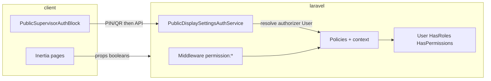

# RBAC migration: Laravel Spatie Permission — scalable transition plan

| | |
|---|---|
| **Doc role** | **Canonical epic** for FlexiQueue RBAC: catalog, global Spatie, route enforcement, admin UI, public auth alignment. |
| **Companion (scoped “dynamic” UI)** | [`docs/architecture/PERMISSIONS-TEAMS-AND-UI.md`](../architecture/PERMISSIONS-TEAMS-AND-UI.md) — **site + program** teams + admin matrices (**after** Phase 3 here). |
| **Related** | [`docs/architecture/PERMISSIONS.md`](../architecture/PERMISSIONS.md) — live permission names; public-site IA separate. |
| **Identity / login / onboarding** | [`HYBRID_AUTH_ADMIN_FIRST_PRD.md`](HYBRID_AUTH_ADMIN_FIRST_PRD.md) — admin-first hybrid auth (local + optional Google); not duplicated in this epic. |

**Pre-production:** If there is **no production data** to preserve, you may **compress** this epic’s migration story — fewer dual-write steps, bolder schema changes, `migrate:fresh` + seed — see [`RBAC_AND_IDENTITY_END_STATE.md`](RBAC_AND_IDENTITY_END_STATE.md) **§1.1**.

**Status (snapshot)**

| Phase | Name | State |
|-------|------|--------|
| **0** | Inventory matrix | **Done** — [`docs/architecture/PERMISSIONS-MATRIX.md`](../architecture/PERMISSIONS-MATRIX.md) |
| **1–2** | Install Spatie, seed catalog, sync users | **Done in repo** |
| **3** | Route enforcement via Spatie `permission:` + policies/`can()` | **Done** — [`routes/web.php`](../../routes/web.php); [`EnsureRole`](app/Http/Middleware/EnsureRole.php) unused on app routes (deprecated alias in `bootstrap/app.php`) |
| **4** | Admin UI: direct permissions + effective display | **Done** — Users page + API |
| **5** | Public auth shell (PIN/QR + Inertia `auth.can.*`) | **Done** — [`PublicAuthCapabilityService`](app/Services/PublicAuthCapabilityService.php), [`HandleInertiaRequests`](app/Http/Middleware/HandleInertiaRequests.php) |
| **6** | **Dynamic scoped permissions** (teams + `RbacTeam` + site/program UI) | **Done** — [`PERMISSIONS-TEAMS-AND-UI.md`](../architecture/PERMISSIONS-TEAMS-AND-UI.md), [`RbacContextService`](../../app/Services/RbacContextService.php), [`ScopedRbacTeamAccessPanel`](../../resources/js/Components/admin/ScopedRbacTeamAccessPanel.svelte) |

**Dynamic permissions (terminology)**  
**Static** = permission *names* in code (`PermissionCatalog`, seeders). **Dynamic** = *who has what* at **global** (roles + direct grants), **site**, or **program** scope — editable by admins without deploy. Global dynamics ship in Phases 2–5; **site/program** dynamics ship with companion plan **Phase 6**.

**Follow-ups (non-blocking):** Controllers may still use `User::isAdmin()` / enum for **site/program business rules**; incremental move to `$user->can()` / policies is §17.7. Optional: audit log for direct permission changes (§4); optional rollout flag (§15).

---

## 1. Why this plan exists

FlexiQueue combines:

- [`UserRole`](app/Enums/UserRole.php) enum (`admin`, `staff`, `super_admin`) on [`User`](app/Models/User.php) — **synced** to Spatie roles; still used for display and some controller scoping (§17.7).
- Program-scoped **supervisor** via `program_supervisors` pivot (not an enum role); `programs.supervise` + [`SpatieRbacSyncService`](app/Services/SpatieRbacSyncService.php).
- **HTTP routes** in [`routes/web.php`](../../routes/web.php): Spatie **`permission:`** middleware (pipe `|` = any). [`EnsureRole`](app/Http/Middleware/EnsureRole.php) is **deprecated** and not applied to app routes.
- **Policies / services / Inertia:** [`StationPolicy`](app/Policies/StationPolicy.php), [`SessionPolicy`](app/Policies/SessionPolicy.php), public services, and [`HandleInertiaRequests`](app/Http/Middleware/HandleInertiaRequests.php) use **`$user->can(PermissionCatalog::…)`** and shared **`auth.can.*`** props; sensitive display/triage UI avoids raw `role` for bypass (see [`PERMISSIONS-MATRIX.md`](../architecture/PERMISSIONS-MATRIX.md) Phase 5).
- Remaining ad hoc checks in some controllers (approval queues, site match) — candidates for policy consolidation over time.

This works but **does not** scale cleanly for:

| Gap | What we need |
|-----|----------------|
| No single catalog | Named, versionable permissions (audit, docs, CI checks) |
| No per-user exceptions | **Direct** `model_has_permissions` without inventing throwaway roles |
| No unified “prove identity” story | Same **permission name** whether the user is in-session or proved via PIN/QR (authorizer `User`) |
| Hard to narrow access | **Least privilege**: split coarse roles into fine permissions over time |
| Future kiosk rules | Program setting: self-serve vs **kiosk-only** staff — permission namespace should be **`kiosk.*`**, not `triage.*`, for clarity |

**Package:** [`spatie/laravel-permission`](https://github.com/spatie/laravel-permission) — roles, permissions, pivot tables, cache, guard support, optional teams.

---

## 2. Goals and non-goals

### 2.1 Goals

1. **Parity-first migration** — Spatie reflects today’s behavior; automated tests prove it.
2. **Scalable permission model** — Stable naming, namespaces, and extension points for new modules without renaming everything later.
3. **Single enforcement story** — Middleware → policies → public auth services all key off the **same** permission strings (or policy methods that delegate to them).
4. **Direct user permissions** — Admin UI to grant/revoke permissions on a user without changing their role.
5. **Operational safety** — Idempotent seeders, cache discipline, rollback notes, observability hooks.

### 2.2 Non-goals (initial migration cut)

- **No** new product roles (e.g. “kiosk officer”) **unless** explicitly scheduled — only **reserve** names and document wiring.
- **No** behavior change for “who is supervisor for program X” — pivot remains source of truth until a deliberate cutover to Spatie teams or synced permissions.
- **No** client-side-only security — Svelte may show/hide UI from Inertia props; **authorization stays server-side**.

---

## 3. Design principles

| Principle | Meaning |
|-----------|---------|
| **Parity first** | Seed/mapping reproduces **current** effective access. |
| **Named permissions** | Dot-separated namespaces: `public.display_settings.apply`, `kiosk.session.create` — treat as **public API** for policies and tests. |
| **Session vs proof** | Spatie answers: “does **User** U have permission P (in context)?” PIN/QR resolves to an **authorizer** `User`; then call the **same** `can()` / policy as a logged-in user. |
| **Server is source of truth** | Inertia exposes **computed booleans** / allowed action lists — not raw permission tables to the client. |
| **Direct user permissions** | `model_has_permissions` for exceptions; document precedence: role permissions **∪** direct grants (Spatie default is allow-oriented). |
| **Deny / exception lists (future)** | If explicit denies are needed, document a **single** approach (custom layer or policy), not ad hoc `!can()` scattered in code. |
| **Kiosk vocabulary** | User-facing and code docs use **kiosk** for public self-service / device flows that create sessions or open triage; avoid overloading **triage** as the permission prefix when the capability is really “use kiosk / create session from kiosk”. |

---

## 4. Permission naming and taxonomy (scalability)

### 4.1 Convention

Use **lowercase** dot-separated segments:

```
<domain>.<resource>.<action>[.<variant>]
```

Examples:

- `public.display_settings.apply` — POST public display settings after auth
- `public.device.authorize` — device cookie / “use this device” style flows
- `programs.supervise` — program supervisor capability (may map to pivot sync)
- `kiosk.session.create` — **reserved/future**: create a queue/session from the **kiosk** path when program disallows self-serve for generic staff
- `kiosk.access` — **reserved/future**: use kiosk device / enter kiosk flow when restricted by program settings

**Renamed from earlier drafts:** Do **not** use `triage.create_session` as the canonical permission id — use **`kiosk.session.create`** (and related `kiosk.*`) so triage UI and kiosk device policy share one clear namespace.

### 4.2 Catalog maintenance

- **Source of truth:** `database/seeders/PermissionCatalogSeeder.php` (or equivalent) registers every permission row with optional `description` column if you extend the table or maintain a parallel `docs/architecture/PERMISSIONS.md`.
- **Stability:** Add new permissions with **new names**; deprecate old names with a comment + migration note rather than silent renames (or provide a one-time rename migration).
- **CI (future):** Optional static check that every `->can('...')` string exists in the catalog seeder.

### 4.3 Initial catalog (illustrative — finalize in Phase 0 matrix)

| Permission | Purpose | Parity note |
|------------|---------|--------------|
| `site.access` / `dashboard.access` | Logged-in app shell | Map from current staff/admin gates |
| `programs.view`, `programs.manage` | Program CRUD / listing | Align with existing controllers |
| `programs.supervise` | Supervisor powers for a program | Sync from `program_supervisors` or wrap pivot in policy |
| `stations.queue.view`, `stations.queue.operate` | Station board | Align with [`StationPolicy`](app/Policies/StationPolicy.php) |
| `public.display_settings.apply` | Save public display settings | After PIN/QR or session bypass |
| `public.device.authorize` | Device authorization flows | EnforceDeviceLock / device cookies |
| `tokens.*`, `sessions.*`, `reports.*` | As per API inventory | Discovered in Phase 0 |
| `kiosk.session.create` | **Future**: session creation from kiosk when locked down | Program setting gates who needs this |
| `kiosk.access` | **Future**: enter restricted kiosk / device | Pair with program “self-serve” flags |

---

## 5. Architecture: how pieces fit together



**Rule:** Any code path that today checks “is staff/admin/supervisor” eventually becomes **`$user->can($permission, $model?)`** or a **policy method** that delegates to Spatie + existing business rules (site_id, pivot, etc.).

---

## 6. Scope phases (recommended)

### Phase 0 — Inventory and matrix (no behavior change)

**Deliverable:** Spreadsheet (or markdown table) — **permission × enforcement location × current rule × test id**.

Enumerate:

- `routes/web.php`, `routes/api.php` — `middleware`, `role:`, `permission:`
- All `Gate::`, `authorize()`, `Policy` classes
- Controllers with manual role checks
- [`EnsureRole`](app/Http/Middleware/EnsureRole.php) and duplicates
- Public: device auth, display settings, device unlock, triage/kiosk bind
- Frontend: `auth.user.role`, `canBypassDeviceLock`, feature flags from [`HandleInertiaRequests`](app/Http/Middleware/HandleInertiaRequests.php)

**Exit criteria:** Stakeholders agree on Phase 2 catalog contents (names only).

---

### Phase 1 — Install Spatie and wire `User` ✅ (done)

- [x] `composer require spatie/laravel-permission`
- [x] Publish migrations; run migrate in dev/staging first
- [x] Add `HasRoles` to `User` (guard `web`)
- [x] Configure `config/permission.php` — **teams remain off** until Phase 6 ([companion doc](../architecture/PERMISSIONS-TEAMS-AND-UI.md))
- [x] Deploy note: `php artisan permission:cache-reset` when roles/permissions change

---

### Phase 2 — Seed roles and permissions (parity mapping) ✅ (done)

**Implemented:** `App\Support\PermissionCatalog`, `database/seeders/PermissionCatalogSeeder.php`, `App\Services\SpatieRbacSyncService`, `App\Services\UserProvisioningService` (via `User::booted()` on relevant saves; replaces the former `UserObserver`), supervisor sync from `ProgramStaffController`; `GET /api/admin/permissions`; `PUT` user `direct_permissions`; seed order in `DatabaseSeeder` + edge/central/lgu/superadmin seeders.

**Spatie roles (mirror enum, do not invent new ones in v1):**

| Spatie role slug | Source today |
|------------------|--------------|
| `super_admin` | `UserRole::SuperAdmin` |
| `admin` | `UserRole::Admin` |
| `staff` | `UserRole::Staff` |

**Supervisor (program-scoped):** Today = staff (or admin) + `program_supervisors`. Choose **one** pattern and document it in an **ADR**-style subsection:

- **Option A — Pivot + synced permission:** Keep `program_supervisors`; a sync job grants `programs.supervise` **per user per program** via direct permission + teams or a naming convention — *or* use Spatie **teams** with `team_id = program_id` and role `program_supervisor`.
- **Option B — Policy-only:** Spatie holds coarse roles; `User::isSupervisorForProgram($program)` remains inside **Policy** until a later migration.

**Recommendation for scalability:** Prefer **explicit permission** `programs.supervise` with **program context** (teams or policy checks) so the same string appears in middleware and public auth.

**Seeder strategy:**

1. Idempotent: `firstOrCreate` roles and permissions.
2. Assign role → permission bundles that match **current** behavior.
3. For each user: assign Spatie role from `UserRole` enum.
4. Sync supervisor grants from `program_supervisors` into Spatie (however Option A/B was chosen).

**Reserved permissions:** Insert `kiosk.session.create`, `kiosk.access` with **no role grants** if you want them present for forward compatibility (optional).

---

### Phase 3 — Replace ad hoc checks (incremental, behind parity tests) ✅

- [x] **`permission:`** middleware on route groups (see matrix); **403 parity** tests (`RbacPermissionRouteMiddlewareTest`, etc.).
- [x] [`StationPolicy`](app/Policies/StationPolicy.php) / [`SessionPolicy`](app/Policies/SessionPolicy.php): delegate to `$user->can(PermissionCatalog::…)` **plus** supervisor pivot rules.
- [x] [`HandleInertiaRequests`](app/Http/Middleware/HandleInertiaRequests.php): **`auth.can.*`** derived from `$user->can()` for public/device/admin capabilities.
- [ ] **`EnsureRole` removal:** class kept **deprecated**; `role` alias in [`bootstrap/app.php`](../../bootstrap/app.php) for compatibility — remove when no consumers remain.
- [ ] **Future (Phase 6):** `User::canInProgram($permission, Program $program)` or teams — **see** [`PERMISSIONS-TEAMS-AND-UI.md`](../architecture/PERMISSIONS-TEAMS-AND-UI.md).
- [ ] **Ongoing:** replace remaining controller `isAdmin()` / `abort(403)` role checks with policies/`can()` where it reduces duplication (§17.7).

**Exit criteria:** Full PHPUnit suite green; no intentional behavior change — **met.**

---

### Phase 4 — Admin UI: roles + direct permissions

**Must-have:**

- [x] User detail (or dedicated screen): **Roles** (multi) + **Direct permissions** (searchable multi-select) — **Done:** [`resources/js/Pages/Admin/Users/Index.svelte`](../../resources/js/Pages/Admin/Users/Index.svelte) + [`UserDirectPermissionsEditor`](../../resources/js/Components/admin/UserDirectPermissionsEditor.svelte); `PUT /api/admin/users/{user}` with `direct_permissions`; Inertia props `assignable_permissions` from [`UserPageController`](../../app/Http/Controllers/Admin/UserPageController.php).
- [x] Guard against removing last admin for a site (existing business rules) — **Done:** [`UserController::assertAnotherActiveAdminExistsForSite`](../../app/Http/Controllers/Api/Admin/UserController.php) on role demotion / deactivate last admin.
- [ ] Optional: audit log table (who granted/revoked `model_has_permissions`)

**Precedence (document in UI):** Effective permissions = role permissions ∪ direct permissions. Warn if a direct grant duplicates a role grant (noise, not error). **UI:** read-only effective list + supervisor pivot note; `platform.manage` assignable only for super admin (checkbox disabled for site admins).

---

### Phase 5 — Public modular auth shell (unified with backend) ✅

- [x] Backend: [`PublicAuthCapabilityService::userMaySkipInteractiveAuthFor`](app/Services/PublicAuthCapabilityService.php) for session bypass + parity with public APIs.
- [x] [`PublicDisplaySettingsAuthService`](app/Services/PublicDisplaySettingsAuthService.php) / device controllers: authorizer **`$user->can('public.display_settings.apply')`**, **`public.device.authorize`** as documented in matrix.
- [x] Inertia: **`auth.can.public_device_authorize`**, **`auth.can.public_display_settings_apply`**, **`auth.can.approve_requests`**, etc. (see matrix Phase 5).
- [x] [`PublicSupervisorAuthBlock`](resources/js/Components/PublicSupervisorAuthBlock.svelte): parents pass **`canBypassAuth`** from server-derived props (same PIN/QR UX).
- [ ] **Optional:** debug props `skip_interactive_auth` / `interactive_auth_permission` (non-production) — not required for security.

**Related:** Public-site IA plan may extend this further.

---

## 7. Dual-write and cutover strategy (robust transition)

To avoid a big-bang failure:

| Stage | `User.role` enum | Spatie | Application checks |
|-------|------------------|--------|---------------------|
| 1 | Authoritative | Seeded | Still read enum in some paths |
| 2 | Authoritative | Sync on save | New code uses Spatie; old code remains |
| 3 | Deprecated | Authoritative | All checks use Spatie; enum kept for DB column / display |
| 4 (optional) | Removed | Only | Migration drops enum column — **only** after full audit |

**Sync:** Model observer or queued job on `User` save: update Spatie role when `UserRole` changes; integration tests for drift.

---

## 8. Phase 6 — Site + program scoping (separate plan; gated)

Spatie **teams** + a surrogate **`RbacTeam`** model enable **dynamic permissions** at **site** and **program** scope (admin-configurable matrices without deploy). This is **Phase 6** in the master table above — **not** part of Phase 3.

**Canonical spec:** [`docs/architecture/PERMISSIONS-TEAMS-AND-UI.md`](../architecture/PERMISSIONS-TEAMS-AND-UI.md) (v1.0 finalized).

| Approach | When |
|----------|------|
| **Policy + `program_supervisors` + direct global grants** | **Now** through Phase 5 — current production path. |
| **Teams + `RbacTeam`** | **Shipped** — companion plan §5 order applied (6A–6F); `hasPermissionInContext` in [`RbacContextService`](../../app/Services/RbacContextService.php). |

**Hard rule:** Enable `config('permission.teams')` only after a **follow-up migration** adds `team_id` columns; never collide raw `site_id` / `program_id` as `team_id`.

---

## 9. Direct user permissions (Spatie native)

Spatie supports:

- `model_has_roles`
- `model_has_permissions` — grants without role change

**Use cases:** temporary elevation, one-off access, migration exceptions, **least-privilege** experiments.

**UI:** Multi-select with search; show effective permissions (role ∪ direct) read-only summary.

---

## 10. Future: kiosk officer / restricted self-serve — **not in initial migration**

**Product idea (documentation only until scheduled):**

- Program setting: e.g. “self-serve kiosk allowed for all staff” vs “only **kiosk**-authorized users”.
- New role (example name): **Kiosk officer** or program-scoped assignment — **not** shipped in v1.
- Permissions:
  - `kiosk.session.create` — create session from kiosk when self-serve is restricted
  - `kiosk.access` — use kiosk device / flow when restricted

**Initial migration:** May **seed** empty `kiosk.*` permissions for catalog completeness; **do not** enforce until product enables the program setting.

**Note:** The old placeholder name `triage.create_session` is **retired** in favor of `kiosk.session.create` to match product language (kiosk device / self-service) rather than the triage UI label alone.

---

## 11. Enforcement layers (reference)

| Layer | Responsibility |
|-------|----------------|
| **Middleware** | `auth`, `permission:foo`, rate limits |
| **Policies** | Resource + context (`$program`, `$station`, site match) |
| **Form requests** | `authorize()` with policy or `can()` |
| **Controllers** | Thin; delegate to policies/services |
| **Public PIN/QR** | Resolve authorizer `User`; then **same** `Gate` / `can()` as session |
| **Inertia** | Computed booleans / allowed actions only |

---

## 12. Testing strategy

| Type | What |
|------|------|
| **Unit** | Permission naming helpers; sync job from enum ↔ Spatie |
| **Feature** | Route middleware; policy per role; supervisor pivot |
| **Public** | Display settings: PIN path and session bypass both hit same authorization |
| **Regression** | Existing staff/admin/supervisor tests unchanged after parity |

**Migration verification:** Snapshot test or script: N users from factories → expected `can()` matrix.

---

## 13. Risks and mitigations

| Risk | Mitigation |
|------|------------|
| Enum + Spatie drift | Observers/sync job; single writer discipline |
| Stale permission cache | Deploy checklist: `permission:cache-reset`; CI seed + cache clear |
| Performance | Spatie cache; avoid N+1 on admin user lists (eager load roles/permissions) |
| Naming churn | Version catalog; deprecate, don’t rename silently |
| Over-wide direct grants | UI warnings; audit log; periodic review |

---

## 14. Observability and compliance (scalability)

- **Logging:** Structured log on permission **deny** in sensitive public endpoints (no PII in message).
- **Audit (optional bead):** `permission_grants` table or activity log for admin UI changes.
- **Docs:** [`docs/architecture/PERMISSIONS.md`](../architecture/PERMISSIONS.md) maintained; optional link from security architecture doc when it exists.

---

## 15. Rollback

- **Code rollback:** Revert to branch before Spatie; migrations may need **down** migrations (publish Spatie down carefully in staging first).
- **Data:** Backup `roles`, `permissions`, pivots before first production migrate.
- **Feature flag (optional):** `config('flexiqueue.rbac.spatie_enforced')` to fall back to enum checks during staged rollout — remove after confidence.

---

## 16. References in repo

- [`app/Enums/UserRole.php`](app/Enums/UserRole.php)
- [`app/Http/Middleware/EnsureRole.php`](app/Http/Middleware/EnsureRole.php)
- [`app/Support/PermissionCatalog.php`](../../app/Support/PermissionCatalog.php)
- [`database/seeders/PermissionCatalogSeeder.php`](../../database/seeders/PermissionCatalogSeeder.php)
- [`app/Policies/StationPolicy.php`](app/Policies/StationPolicy.php)
- [`resources/js/Components/PublicSupervisorAuthBlock.svelte`](resources/js/Components/PublicSupervisorAuthBlock.svelte)
- [`docs/architecture/PERMISSIONS-TEAMS-AND-UI.md`](../architecture/PERMISSIONS-TEAMS-AND-UI.md) — Phase 6 dynamic scoped permissions
- Public-site IA (separate): `.cursor/plans/public_site_ia_and_auth_tiers_*.plan.md`

---

## 17. Implementation roadmap (Phase 3–5 — **done**; Phase 6+ **next**)

**Shipped state:** [`routes/web.php`](../../routes/web.php) uses Spatie **`permission:`** middleware (including pipe `|` for “any of”). **Spatie** is the source of permission checks for **route entry**; [`EnsureRole`](app/Http/Middleware/EnsureRole.php) is **not** used on application routes (deprecated alias only). **`users.role`** enum remains for **sync**, **display**, and **some** controller logic until §17.7 milestone.

**Next target (optional hardening):** Fewer duplicate `isAdmin()` checks in controllers; **`EnsureRole`** removed from codebase; enum read-only for authorization — see §17.7.

### 17.1 Prerequisite — Phase 0 (inventory) ✅

| Task | Output |
|------|--------|
| Build the **permission × route/controller/policy × test** matrix | [`docs/architecture/PERMISSIONS-MATRIX.md`](../architecture/PERMISSIONS-MATRIX.md) |
| Route groups in [`routes/web.php`](routes/web.php) | Mapped to Spatie `permission:` names (G1–G23) |
| Inertia capability props | **`auth.can.*`** documented in matrix Phase 5 |

**Exit:** Met.

### 17.2 Middleware strategy ✅

**Chosen approach:** Spatie **`permission:`** middleware with **pipe** syntax for supervisor-equivalent access (`staff.operations` **or** `admin.manage`, etc.), plus **direct** grants from [`SpatieRbacSyncService`](app/Services/SpatieRbacSyncService.php) for pivot supervisors.

**Deliverables:**

- [x] Each route group mapped to **exact** permission(s) — matrix.
- [x] **`role:…`** groups replaced; **feature tests** per route class (`RbacPermissionRouteMiddlewareTest`, etc.).
- [x] **403 parity** for staff/admin/super_admin splits.

### 17.3 Policies and controllers

- [x] [`StationPolicy`](app/Policies/StationPolicy.php), [`SessionPolicy`](app/Policies/SessionPolicy.php): **`$user->can(PermissionCatalog::…)`** **plus** `programs.supervise` / `isSupervisorForProgram` **plus** assignment rules.
- [x] Controllers with **inline** `isAdmin()` / supervisor checks — migrated to [`StaffProgramAccessService`](../../app/Services/StaffProgramAccessService.php), [`ProgramDeviceApprovalService`](../../app/Services/ProgramDeviceApprovalService.php), and `Gate::authorize` + updated policies (see [`RBAC_POLICY_CLEANUP.md`](../plans/RBAC_POLICY_CLEANUP.md)).
- [x] **Super admin vs site admin:** `platform.manage` vs `admin.manage` / `admin.shared` split preserved in routes + permissions.

### 17.4 Public / PIN / QR flows

- [x] [`PublicDisplaySettingsAuthService`](app/Services/PublicDisplaySettingsAuthService.php), device unlock, display-settings-requests: after resolving authorizer user, assert **`$authorizer->can('public.display_settings.apply')`** (or the chosen name) **in addition to** existing PIN validation.
- [x] Grant that permission via **roles + direct grants** so behavior matches today (staff/admin bypass rules stay in one policy method).
- [x] Central helper [`PublicAuthCapabilityService::userMaySkipInteractiveAuthFor`](app/Services/PublicAuthCapabilityService.php) for session bypass + documented parity with public APIs.

### 17.5 Inertia and frontend

- [x] [`HandleInertiaRequests`](app/Http/Middleware/HandleInertiaRequests.php): **`auth.can.*`** derived from `$user->can()` for stable names (`public_device_authorize`, `public_display_settings_apply`, `approve_requests`, `staff_operations`, `admin_manage`); `device_locked` uses `public.device.authorize`.
- [x] Svelte: device bypass / display footer / triage board use **`auth.can.public_device_authorize`** (and `auth.can.approve_requests` where applicable), not raw `auth.user.role`.

### 17.6 Admin UI (complete Phase 4)

- [x] **Users** admin page: multi-select **direct permissions** (API exists; wire UI + validation messages).
- [x] Optional: show **effective** permissions (role ∪ direct) read-only.
- [x] Guardrails: cannot strip last site admin; cannot assign `platform.manage` without super admin (API + UI).

### 17.7 Enum and column (late phase — do not rush)

- [x] Treat `users.role` as **synced** with Spatie role — documented in [`PERMISSIONS.md`](../architecture/PERMISSIONS.md) (“Single writer”).
- [ ] Dropping enum from **authorization** entirely — deferred; new code uses `can()` (see [`RBAC_POLICY_CLEANUP.md`](../plans/RBAC_POLICY_CLEANUP.md)).
- [x] **Single writer** documented: [`PERMISSIONS.md`](../architecture/PERMISSIONS.md) + [`RBAC_POLICY_CLEANUP.md`](../plans/RBAC_POLICY_CLEANUP.md).

### 17.8 Testing and rollout

- [x] **Feature tests** per migrated route group (same status codes as today).
- [ ] Optional **config flag** `flexiqueue.rbac.spatie_enforced` for staged rollout (see §15) — **not implemented**.
- [x] Deploy: **`php artisan permission:cache-reset`** documented in [`docs/DEPLOYMENT.md`](../DEPLOYMENT.md) and Phase 1 checklist.

### 17.9 Suggested order of execution (sprints)

| Sprint | Focus |
|--------|--------|
| **A** | Finish matrix + name any missing permissions; extend `PermissionCatalogSeeder` if needed |
| **B** | Migrate **read-only** API groups first (e.g. dashboard) with parity tests |
| **C** | Migrate **admin** `/api/admin` groups (hardest: super_admin vs admin split) |
| **D** | Policies + session/station APIs |
| **E** | Public PIN/QR + `public.*` permissions |
| **F** | Inertia + Admin Users UI |
| **G** | Remove `EnsureRole` / enum from auth path (optional flag during G) |
| **H** | **Phase 6:** Scoped teams + UI per [`PERMISSIONS-TEAMS-AND-UI.md`](../architecture/PERMISSIONS-TEAMS-AND-UI.md) (after G is stable) |

---

## 18. Definition of done (whole RBAC + dynamic scoping epic)

### Core RBAC (this document — Phases 0–5)

- [x] Phase 0: **PERMISSIONS-MATRIX** — every route group mapped to permission names
- [x] Phase 3: Routes use **`permission:`** middleware; policies/services use **`can()`**; **`EnsureRole`** unused on app routes (deprecated); full test suite green
- [x] Phase 4: Admin **UI** for direct permissions + effective readout (API + Users page)
- [x] Phase 5: Public flows use shared permission checks + Inertia props from server
- [x] [`docs/architecture/PERMISSIONS.md`](../architecture/PERMISSIONS.md) — catalog table aligned with `PermissionCatalog`
- [x] Seeder idempotent (`PermissionCatalogSeeder`); deploy runbook includes **`permission:cache-reset`** ([`DEPLOYMENT.md`](../DEPLOYMENT.md))
- [x] **`kiosk.*`** reserved in catalog; **`triage.create_session`** not used as permission id (see §10)

### Dynamic scoped permissions (companion — Phase 6)

- [x] [`PERMISSIONS-TEAMS-AND-UI.md`](../architecture/PERMISSIONS-TEAMS-AND-UI.md) **acceptance criteria** (§6) satisfied: site + program admin matrices, `hasPermissionInContext`, tests

---

## 19. Document history

| Date | Change |
|------|--------|
| — | Expanded: phases, dual-write, kiosk naming, observability, rollback |
| **2026-03-22** | **Finalized v1.0:** master phase table (0–6), **dynamic permissions** glossary, Phases 1–2 marked done, §8 reframed as Phase 6 + companion doc, DoD split core vs scoped, cross-links |
| **2026-03-22** | **Epic close-out (Phases 0–5):** status table + §1/§17/§18 synced to shipped Spatie enforcement; [`PERMISSIONS.md`](../architecture/PERMISSIONS.md) added; [`DEPLOYMENT.md`](../DEPLOYMENT.md) Spatie cache-reset; matrix gaps updated |
| **2026-03-22** | **Phase 6 shipped:** companion doc status + §6 criteria; teams + `RbacTeam` + scoped API/UI; [`DEPLOYMENT.md`](../DEPLOYMENT.md) Phase 6 subsection |
| **2026-03-22** | **Policy cleanup:** [`RBAC_POLICY_CLEANUP.md`](../plans/RBAC_POLICY_CLEANUP.md); `StaffProgramAccessService`, `ProgramDeviceApprovalService`, `RbacContextService::canInProgramTeamOnly`, policies + admin pages use `platform.manage`; removed unused `EnsureRole` middleware |
| **2026-03-22** | **Pre-production note** at top: link to [`RBAC_AND_IDENTITY_END_STATE.md`](RBAC_AND_IDENTITY_END_STATE.md) §1.1 (aggressive cleanup while in dev). |
