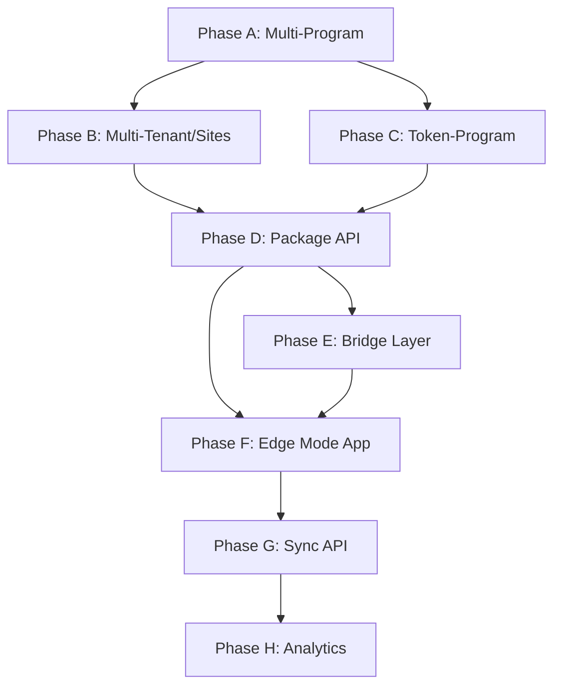

# FlexiQueue: Central Server + Edge Pi Vision (Future Feature)

**Status:** Future feature — for planning only. Not in current scope or roadmap until explicitly prioritized.

**Purpose:** Detail the target architecture (central server + Pi edge, sync, multi-program) and document current behaviors, existing pieces, design decisions, and the complete implementation plan for when this is taken up.

---

## Part 1 — Target Vision (Summary)

### Roles

| Role | Where | Responsibility |
|------|--------|----------------|
| **Central server** | Internet hosting (VPS, etc.) | Single source of truth for programs, TTS generation, token creation, program setup. Runs full app. Can serve multiple programs; `/display` can subscribe to different programs. |
| **Pi (edge)** | On-site (e.g. MSWDO office) | "Takes" a program (downloads config + data). Operates in two connectivity tiers: **Bridge Layer** (online—proxies to central API) or **Offline Mode** (uses packaged/synced local data). Runs sessions locally; logs sync back to central. |
| **Display (central)** | Browsers hitting central | Can show **different programs** (multi-program display). |
| **Display (Pi)** | Browser/kiosk on Pi | When online (bridge): can hit central or local Pi. When offline: hits **local Pi** only; all data and TTS come from local. |

### The Two-Tier Connectivity Model

This is the **core architectural innovation**. The Pi operates in one of two tiers at any given time:

```
┌─────────────────────────────────────────────────────────┐
│                    CENTRAL SERVER                        │
│  Source of truth: programs, tokens, clients, TTS, users  │
└─────────────┬──────────────────────┬────────────────────┘
              │                      │
    ┌─────────┴─────────┐  ┌────────┴──────────┐
    │  BRIDGE LAYER      │  │  MANUAL SYNC       │
    │  (real-time API)   │  │  (package-based)    │
    │                    │  │                     │
    │  • Pi has internet │  │  • Pi is offline    │
    │  • Proxies to      │  │  • Uses local DB    │
    │    central API     │  │  • Subset of data   │
    │  • Full features   │  │  • Limited features │
    │  • Live data       │  │  • Batch upload     │
    └─────────┬──────────┘  └────────┬────────────┘
              │                      │
              └──────────┬───────────┘
                         │
              ┌──────────┴──────────┐
              │    ORANGE PI (EDGE)  │
              │    Runs same app     │
              │    APP_MODE=edge     │
              └─────────────────────┘
```

#### Tier 1: Bridge Layer (Online)
When Pi has internet connectivity, it acts as a **thin client** that proxies certain operations to central's API in real-time:
- **Client lookup/search** → queries central's API directly
- **Client creation** → creates on central via API
- **ID registration** → full identity registration flow via central
- **Token availability** → checks token status on central
- **All features enabled** — as if the user were on central, but the session/queue engine runs locally on Pi for low-latency operations

#### Tier 2: Manual Sync (Offline)
When Pi has no internet, it runs entirely on locally synced/packaged data:
- **Client lookup** → searches local synced `clients` table (name + birth_year only; no encrypted ID numbers)
- **Client creation** → **DISABLED** — cannot create new clients offline
- **ID registration** → **DISABLED** — no identity registration on offline Pi
- **Client binding to token** → **ALLOWED** — staff can bind a token to an already-synced client record
- **Token management** → uses packaged tokens only; no availability checks against central
- **Sessions, calls, transfers, etc.** → fully functional with local data

### Feature Matrix: Bridge Layer vs Offline Mode

| Feature | Bridge Layer (Online) | Offline (Synced Data) |
|---------|----------------------|----------------------|
| Session bind | ✅ Full | ✅ Full |
| Session call/serve/transfer/complete | ✅ Full | ✅ Full |
| Client lookup by name | ✅ Via central API | ✅ Local synced data only |
| Client lookup by ID hash | ✅ Via central API | ✅ Local synced hashes |
| Client creation | ✅ Via central API | ❌ Disabled |
| ID registration (public triage) | ✅ Via central API | ❌ Disabled |
| Identity binding mode: required | ✅ Full | ⚠️ Auto-downgraded to `optional` (can only bind to known clients) |
| Identity binding mode: optional | ✅ Full | ✅ Bind to synced clients or skip |
| Identity binding mode: disabled | ✅ Full | ✅ Full |
| Token creation | ❌ Central only | ❌ Disabled |
| Token availability check | ✅ Via central API | ✅ Local packaged tokens |
| TTS playback | ✅ Pre-generated + live fallback | ✅ Pre-generated (packaged) + browser fallback |
| TTS generation (ElevenLabs) | ❌ Central only | ❌ Disabled |
| Admin program CRUD | ❌ Central only | ❌ Read-only |
| Admin user management | ❌ Central only | ❌ Read-only |
| Display board | ✅ Full | ✅ Full (local Reverb) |
| Analytics | ✅ Local edge analytics | ✅ Local edge analytics |
| Permission requests / overrides | ✅ Full | ✅ Full (local) |
| Real-time broadcasting | ✅ Local Reverb | ✅ Local Reverb |
| Sync data to central | ✅ Auto (bridge) | ⏳ Manual sync trigger |

### Edge Mode Settings (Configurable "Knobs")

Admin on central configures per-site edge settings:

| Setting | Type | Description |
|---------|------|-------------|
| `sync_clients` | bool | Whether to include client records in the package |
| `sync_client_scope` | enum | `all`, `program_history`, `site_scoped` — which clients to package |
| `sync_tokens` | bool | Whether to package tokens (false = use bridge layer for tokens) |
| `sync_tts` | bool | Whether to package TTS audio files |
| `bridge_enabled` | bool | Whether the bridge layer is available (requires internet config) |
| `offline_binding_mode_override` | enum | What identity_binding_mode becomes when offline (`optional`, `disabled`) |

Example scenarios:
- **Pi at remote MSWDO office (no internet):** `sync_clients=true, sync_tokens=true, sync_tts=true, bridge_enabled=false`
- **Pi at urban office (has WiFi):** `sync_clients=false, sync_tokens=false, sync_tts=true, bridge_enabled=true` — relies on bridge for everything except TTS (always packaged for reliability)

### Main flows (vision)

1. **Program authoring and TTS**  
   Done on central only. Tokens created on central; token + station TTS generated (ElevenLabs), stored on central, then **included in program package** when sync_tts=true.

2. **Pi "takes" a program (Manual Sync)**  
   Pi downloads a **program package**: program config (name, settings, tracks, steps, stations, processes), token set (if `sync_tokens=true`), client records (if `sync_clients=true`, name and birth_year only — **no encrypted ID numbers**), id_document hashes (for lookup only), TTS asset files (if `sync_tts=true`), user accounts (staff assigned to this program).

3. **Pi runs sessions (Bridge or Offline)**  
   Same queue/session logic as today: bind, call, serve, transfer, complete, cancel, no-show, override. State and `transaction_logs` are always **local on Pi**. When bridge is active, client lookups/creates proxy to central.

4. **Sync Pi → Central (Upload)**  
   - **Bridge active:** Session data is uploaded automatically in background.
   - **Offline:** Manual trigger ("Sync Now" button in admin) or scheduled end-of-day job. Pi sends `transaction_logs`, `queue_sessions`, `program_audit_log`, `staff_activity_log` to central.

5. **Central display: multiple programs**  
   Central server has many programs (optionally many sites/locations). `/display?program=X` shows one program's board; staff can switch which program a display shows.

6. **Same program logic everywhere**  
   One queue/session engine (bind → call → transfer → complete, etc.). It runs on central when clients are online and on Pi when the Pi is offline.

### Tenant / site (vision)

- **Tenant** = site or location (e.g. one MSWDO office).
- Central can hold **many sites**; each site may have one or more **programs**.
- A Pi is associated with a **site** (or program); it syncs "its" program and pushes back logs for that site/program.
- (Optional) Users and programs are scoped by site for multi-tenant auth and data.

---

## Part 2 — Current System (Existing Behaviors & Components)

### 2.1 Deployment and topology

- **Today:** One app instance = one server. Production is **on-Pi**: Laravel + Nginx + SQLite + Reverb run **on** the Orange Pi; staff and clients connect to the Pi (e.g. `http://orangepione.local`).
- **Docs:** `docs/architecture/10-DEPLOYMENT.md`, `docs/BEGINNER-DEPLOYMENT-GUIDE.md`.
- **DB:** SQLite on Pi (`database/database.sqlite`); schema must stay portable to MariaDB (see `04-DATA-MODEL.md`).
  - **73 migrations** in `database/migrations/`.
  - Both SQLite and MariaDB branches maintained for every driver-specific migration.
- **No** notion of "central" vs "edge"; no sync; no bridge layer; no "program package" or offline mode.

### 2.2 Data model (existing) — Full entity catalog

| Table | Model | Key Columns | Notes |
|-------|-------|-------------|-------|
| `programs` | `Program` | id, name, description, is_active, is_paused, settings (JSON), created_by | **Single active program** enforced via `Program::where('is_active', true)->first()` in **21 locations across 11 files**. |
| `tokens` | `Token` | id, physical_id, pronounce_as, qr_code_hash (immutable), status, current_session_id, tts_audio_path, tts_status, tts_settings (JSON per-language) | SoftDeletes. **No program_id** — global. |
| `queue_sessions` | `Session` | id, token_id, client_id, identity_registration_id, program_id, track_id, alias, client_category, current_station_id, holding_station_id, is_on_hold, current_step_order, override_steps (JSON), status, no_show_attempts | Statuses: waiting, called, serving, completed, cancelled, no_show. |
| `transaction_logs` | `TransactionLog` | id, session_id, station_id, staff_user_id (nullable), action_type, previous_station_id, next_station_id, remarks, metadata (JSON), created_at | **Append-only** — update/delete throw RuntimeException. |
| `stations` | `Station` | id, program_id, name, capacity, client_capacity, holding_capacity, priority_first_override, settings (JSON), is_active | TTS config in `settings.tts.languages.{lang}`. |
| `service_tracks` | `ServiceTrack` | id, program_id, name, is_default, color_code | Logical flows (Regular, PWD, etc.). |
| `track_steps` | `TrackStep` | id, track_id, station_id (nullable), process_id, step_order | Per PROCESS-STATION-REFACTOR: process_id is primary link. |
| `processes` | `Process` | id, program_id, name, expected_time_seconds | Logical work types. M:M with stations via `station_process`. |
| `users` | `User` | id, name, email, password, role (admin/supervisor/staff), assigned_station_id, availability_status, override_pin_hash, override_qr_hash | Staff auth and assignment. |
| `clients` | `Client` | id, name, birth_year | Minimal identity record for XM2O binding. |
| `client_id_documents` | `ClientIdDocument` | id, client_id, id_type, id_number_encrypted, id_number_hash | **Encrypted** via `Crypt::encryptString()` (APP_KEY dependent). Hash via SHA-256 (key-independent). |
| `identity_registrations` | `IdentityRegistration` | id, program_id, session_id, name, birth_year, client_category, id_type, id_number_encrypted, id_number_last4, status | Public triage identity verification. Uses encryption. |
| `client_id_audit_log` | `ClientIdAuditLog` | id, client_id, client_id_document_id, staff_user_id, action, id_type, id_last4 | Audit trail for ID reveals. |
| `program_audit_log` | `ProgramAuditLog` | id, program_id, action_type, metadata (JSON), created_at | Immutable program events. |
| `staff_activity_log` | — | id, user_id, action_type, metadata (JSON), created_at | Staff availability changes. |
| `permission_requests` | `PermissionRequest` | id, session_id, requester_user_id, responder_user_id, type, status, custom_steps (JSON) | Override permission flow. |
| `temporary_authorizations` | `TemporaryAuthorization` | id, user_id, type, value_hash, expires_at | Temporary PIN/QR for supervisors. |
| `tts_accounts` | `TtsAccount` | id, api_key (encrypted), model_id, is_active, label | ElevenLabs account management. |
| `print_settings` | `PrintSetting` | id, settings, bg_image | Token print template. |
| `program_diagrams` | `ProgramDiagram` | id, program_id, layout data | Visual program flow. |
| `station_notes` | `StationNote` | id, station_id, content | Staff-facing notes. |

### 2.3 Identity Binding System — Detailed (Critical for Edge)

This is the most complex subsystem impacted by edge mode.

**Architecture:**
```
  Client ─── 1:N ──→ ClientIdDocument
    │                    │
    │                    ├── id_number_encrypted (APP_KEY dependent)
    │                    └── id_number_hash (SHA-256, key-independent)
    │
    └── referenced by: Session.client_id, IdentityRegistration.client_id
```

**Encryption details:**
- `ClientIdNumberHasher::hash()` computes `SHA-256(UPPERCASE_TYPE | NORMALIZED_NUMBER)` — **APP_KEY independent**, deterministic, portable across instances.
- `Crypt::encryptString()` uses Laravel's encryption (AES-256-CBC with APP_KEY) — **APP_KEY dependent**, different key = cannot decrypt.
- `ClientIdDocumentService::lookupById()` uses **hash-based lookup** only — does not decrypt.
- `ClientIdDocumentService::revealForAdmin()` — **only** place that decrypts — creates audit log entry.
- `IdentityRegistration.id_number_encrypted` — used by `verifyId()` to compare scanned ID against stored value (requires decryption).

**Impact on edge mode:**
- **Hash-based lookup works cross-instance** — Pi can match "does this ID exist?" without needing central's APP_KEY.
- **Decryption does NOT work cross-instance** — Pi cannot decrypt central's encrypted ID numbers (different APP_KEY).
- **Decision:** Pi gets hashes only. No encrypted values synced. Admin reveal is central-only.

**Binding modes per program (`ProgramSettings.getIdentityBindingMode()`):**
- `disabled` — no client binding UI shown
- `optional` — binding available but skippable
- `required` — triage blocked until client bound

**Edge mode override:** When Pi is offline and mode is `required`, **auto-downgrade to `optional`** — staff can bind to synced clients or skip. This prevents triage from being completely blocked when the client record isn't in the local sync.

### 2.4 Single active program — All 21 locations

| # | File | Context |
|---|------|---------|
| 1 | `SessionService.php:45` | `bind()` — finds active program for new session |
| 2 | `DisplayBoardService.php:28` | `getBoardData()` — loads board for single active program |
| 3 | `StaffDashboardController.php:30` | Staff dashboard page data |
| 4 | `StationPageController.php:29` | Station page: loads program context |
| 5 | `HomeController.php:41` | Home page: checks for active program |
| 6 | `StaffDashboardService.php:45` | Dashboard stats |
| 7 | `HandleInertiaRequests.php:49` | Shared Inertia data (every page) |
| 8 | `TriagePageController.php:24` | Triage page |
| 9 | `ProgramOverridesPageController.php:29` | Override management |
| 10–15 | `IdentityRegistrationController.php` | 6 methods (lines 31, 75, 132, 173, 229, 294) |
| 16 | `UserPageController.php:37` | User management |
| 17–19 | `PublicTriageController.php` | 3 methods (lines 55, 102, 385) |
| 20–21 | `ProgramService.php` | Activation/deactivation logic (lines 56, 64–65) |

### 2.5 Session lifecycle (existing) — Full action matrix

| Action | From → To | Events | Notes |
|--------|-----------|--------|-------|
| Bind | — → waiting | ClientArrived, QueueLengthUpdated, StationActivity | Uses FlowEngine for first station |
| Call | waiting → called | StatusUpdate, QueueLengthUpdated, StationActivity | Enforces client_capacity |
| Serve | called/waiting → serving | StatusUpdate, NowServing, QueueLengthUpdated, StationActivity | Direct serve enforces capacity |
| Transfer | serving → waiting@next | StatusUpdate, ClientArrived, NowServing, QueueLengthUpdated×2 | Standard (FlowEngine) or custom target |
| Complete | serving → completed | via finishSession | Validates required steps done |
| Cancel | waiting/called/serving → cancelled | via finishSession | Optional remarks |
| Hold | serving → serving (on_hold) | StatusUpdate, QueueLengthUpdated | Enforces holding_capacity |
| Resume | on_hold → serving | StatusUpdate, QueueLengthUpdated, NowServing | Re-checks client_capacity |
| Enqueue Back | called/serving → waiting (end) | StatusUpdate, QueueLengthUpdated | Preserves no_show_attempts |
| No-Show | any active → waiting or no_show | StatusUpdate, QueueLengthUpdated | Max attempts configurable |
| Force Complete | any active → completed | via finishSession | Supervisor auth + reason required |
| Override | any active → waiting@target | — | Route deviation; supervisor auth |

### 2.6 Real-time broadcasting — Full channel map

| Channel | Events | Scope |
|---------|--------|-------|
| `display.activity` | StationActivity | Public — all stations |
| `display.station.{id}` | StationActivity, StationDisplaySettingsUpdated | Public — per station |
| `global.queue` | QueueLengthUpdated, StatusUpdate, NowServing, ProgramStatusChanged | Public — all |
| `station.{id}` | ClientArrived, StatusUpdate, QueueLengthUpdated, NowServing, StationNoteUpdated, StaffAvailabilityUpdated | Public — per station |
| `admin.token-tts` | TokenTtsStatusUpdated | Private — admin only |
| `admin.station-tts` | StationTtsStatusUpdated | Private — admin only |

### 2.7 TTS pipeline — Summary

- `TtsService` (ElevenLabs via `ElevenLabsClient`), cache under `storage/app/tts/`.
- Token TTS: `tts/tokens/{id}.mp3`, per-language config in `token.tts_settings`.
- Station TTS: in `station.settings.tts.languages.{lang}`.
- Display playback: two-segment (token audio + connector + station phrase), repeat count/delay configurable.
- Browser fallback (Web Speech API) when pre-generated unavailable.
- **For edge:** TTS files are **always synced via manual sync** — never via bridge layer (too heavy for real-time). Browser fallback covers any gaps.

### 2.8 Services inventory — Single-program coupling

| Service | Coupled to single-active-program? | Edge mode impact |
|---------|----------------------------------|-----------------|
| `SessionService` (1204 lines) | **Yes** — `bind()` | Must accept programId param |
| `DisplayBoardService` (502 lines) | **Yes** — `getBoardData()` | Must accept programId param |
| `StaffDashboardService` | **Yes** | Must accept programId param |
| `DashboardService` | **Yes** | Must accept programId param |
| `ProgramService` | **Yes** — activation logic | Edge mode: single program, always active |
| `FlowEngine` (75 lines) | No — uses session.track_id | Works as-is on edge |
| `StationSelectionService` | No — uses process_id + program_id param | Works as-is |
| `StationQueueService` | Indirect — by station_id | Works as-is |
| `TtsService` (242 lines) | No | Edge: `isEnabled()` returns false (no API key) |
| `IdentityBindingService` (110 lines) | No | Edge: constrained by connectivity tier |
| `ClientIdDocumentService` (208 lines) | No | Edge offline: hash-lookup only, no decrypt |
| `AnalyticsService` (21354 bytes) | Param-based (program_id) | Edge: local edge analytics |
| All other services | No | Work as-is |

### 2.9 Frontend — 24 Svelte pages

| Category | Pages |
|----------|-------|
| Admin | Dashboard, Programs/{Index,Show}, Tokens/{Index,Print}, Users/Index, Logs/Index, Analytics/Index, Settings/Index, ProgramDefaultSettings, Clients/{Index,Show} |
| Display | Board, StationBoard, Status |
| Triage | Index (staff), PublicStart (public) |
| Station | Index |
| Staff | Dashboard |
| Other | Home, Profile/Index, ProgramOverrides/Index, Auth/Login, BroadcastTest |

---

## Part 3 — Gap Map: Current → Vision

| # | Vision piece | Exists? | Gap | Effort |
|---|-------------|---------|-----|--------|
| 1 | Central server as main app | Partial | No mode toggle, no sync, no bridge | Low |
| 2 | **Bridge Layer** | **No** | **New service layer: `BridgeService` that proxies API calls to central when online. Connectivity detection. Feature toggle per endpoint.** | **High** |
| 3 | Multi-tenant / sites | No | No `sites` table; no tenant scoping | High |
| 4 | Multi-program display | No | 21 single-active-program locations; no program selector on display | High |
| 5 | Program package (export) | No | No export API; no package format spec; need configurable `sync_*` knobs | Medium |
| 6 | TTS in package | No | No export; TTS files must be bundled (always via manual sync, never bridge) | Medium |
| 7 | Token-program scoping | No | No program_id; need pivot table for selective packaging | Medium |
| 8 | Client data sync (offline) | No | Need selective client export (name/birth_year only, hashes only, no encrypted data) | Medium |
| 9 | **Identity binding edge rules** | **No** | **Need auto-downgrade of `required`→`optional` on offline Pi; disable client creation/ID registration on offline; enable via bridge when online** | **Medium** |
| 10 | Pi as server (edge mode) | No | No APP_MODE flag; no package import; no edge-specific UI | Very High |
| 11 | Sync Pi → Central (upload) | No | No upload API; no UUID/idempotency; no ID mapping | Very High |
| 12 | Event scoping by program | No | Channels are global; need `{programId}` suffix for multi-program | Medium |
| 13 | **Edge mode settings (knobs)** | **No** | **Configurable per-site: what gets synced, bridge enabled, offline binding override** | **Medium** |
| 14 | Edge analytics vs central analytics | No | Need separate classification; central = inclusive of all sites | Low |

---

## Part 4 — Detailed Phase Plan

### Phase A: Multi-Program Foundation

**Goal:** Remove single-active-program assumption. Prerequisite for everything else.

1. Refactor all **21 single-active-program locations** to accept explicit `$programId`
2. Allow multiple programs `is_active = true` simultaneously
3. Add `$programId` to broadcasting channels (e.g. `display.activity.{programId}`)
4. Add program selector to display UI (`?program=X` + dropdown in `Board.svelte`)

---

### Phase B: Multi-Tenant / Sites

**Goal:** Scope programs, users, and data by site.

1. Create `sites` table: id, name, slug, settings (JSON), edge_settings (JSON)
2. Add `site_id` to: programs, users (or pivot)
3. Tenant middleware: resolve site from request context
4. `edge_settings` JSON stores the configurable "knobs" per site

---

### Phase C: Token-Program Association

**Goal:** Associate tokens with programs for selective packaging.

1. Create `program_token` pivot table: program_id, token_id, timestamps
2. Admin UI: assign/unassign tokens to programs
3. Package exporter queries this pivot to determine which tokens to include
4. Existing token lifecycle (bind/release) unchanged

---

### Phase D: Program Package API (Manual Sync — Download)

**Goal:** Export a complete program as a downloadable package.

#### Package Format

```
flexiqueue-package-{program_id}-{timestamp}.tar.gz
├── manifest.json          ← Package metadata + checksums
├── program.json           ← Program config + settings
├── stations.json          ← Stations + settings + process associations
├── service_tracks.json    ← Tracks + steps
├── processes.json         ← Processes
├── users.json             ← Staff accounts (hashed passwords, assignments)
├── tokens.json            ← Tokens (if sync_tokens=true) with physical_id, qr_hash, tts paths
├── clients.json           ← Clients (if sync_clients=true) — name + birth_year ONLY
├── id_document_hashes.json ← ClientIdDocument hashes ONLY (no encrypted values)
├── print_settings.json    ← Token print template
├── program_diagram.json   ← Visual layout
├── edge_settings.json     ← Edge mode configuration knobs
├── tts/                   ← TTS audio files (if sync_tts=true)
│   ├── tokens/            ← Token TTS MP3s (per language)
│   │   ├── 1_en.mp3
│   │   ├── 1_fil.mp3
│   │   └── ...
│   └── stations/          ← Station phrase MP3s (per language)
│       ├── station_1_en.mp3
│       └── ...
└── temporary_authorizations.json ← Supervisor temp PINs/QRs
```

#### Client Data Rules in Package

| Scenario | What's included | Why |
|----------|----------------|-----|
| `sync_clients=true, scope=program_history` | Clients who had sessions in this program | Minimal, relevant subset |
| `sync_clients=true, scope=all` | All clients in the system | Full coverage; privacy concern for multi-site |
| `sync_clients=true, scope=site_scoped` | Clients who had sessions at this site | Best for multi-tenant |
| `sync_clients=false` | No client data | Pi uses bridge layer for client operations |

**What is NEVER in the package:**
- `client_id_documents.id_number_encrypted` — encrypted values stay on central
- Raw ID numbers in any form
- `identity_registrations` with encrypted data
- `tts_accounts` (ElevenLabs API keys)

**What IS in the package (for hash-based lookup):**
- `client_id_documents.id_number_hash` + `id_type` + `client_id` — enables the offline Pi to answer "does this ID exist in our system?" without decrypting anything

#### API

```
GET /api/admin/programs/{program}/export-package
  ?sync_clients=true
  &client_scope=program_history
  &sync_tokens=true
  &sync_tts=true
  → Returns .tar.gz file
```

#### Import on Pi

```bash
php artisan flexiqueue:import-package /path/to/package.tar.gz
```
- Reads manifest, creates/updates local DB records
- Copies TTS files to local storage
- Sets imported program as active
- Records import timestamp for delta sync

---

### Phase E: Bridge Layer Service

**Goal:** When Pi has internet, proxy specific operations to central's API in real-time.

#### Architecture

```php
// app/Services/BridgeService.php
class BridgeService
{
    public function isOnline(): bool;          // Connectivity check
    public function isEnabled(): bool;         // edge_settings.bridge_enabled
    
    // Client operations (proxied to central)
    public function searchClients(array $params): array;
    public function lookupClientById(string $idType, string $idNumber): array;
    public function createClient(string $name, int $birthYear): array;
    
    // Token operations (proxied to central)
    public function checkTokenAvailability(string $qrHash): array;
    
    // Identity registration (proxied to central)
    public function createIdentityRegistration(array $data): array;
}
```

#### How Services Switch Between Bridge and Local

```php
// In a controller or service:
if ($bridge->isEnabled() && $bridge->isOnline()) {
    // Bridge mode: full features via central API
    $clients = $bridge->searchClients($params);
    $canCreateClients = true;
    $canRegisterIdentity = true;
} else {
    // Offline mode: local data, limited features
    $clients = $localClientService->searchClients($params);
    $canCreateClients = false;
    $canRegisterIdentity = false;
    
    // Auto-downgrade required binding to optional
    if ($bindingMode === 'required') {
        $bindingMode = 'optional';
    }
}
```

#### Bridge Layer vs Manual Sync — What Goes Where

| Data type | Bridge Layer (live) | Manual Sync (packaged) |
|-----------|--------------------|-----------------------|
| Client lookup/create | ✅ Real-time API | ✅ Local synced data |
| Token availability | ✅ Real-time API | ✅ Local packaged |
| TTS audio files | ❌ Never (too large) | ✅ Always via package |
| Session data upload | ✅ Background auto-sync | ✅ Manual batch upload |
| Program config updates | ✅ Auto-refresh | ✅ Re-download package |

#### Connectivity Detection

```php
class BridgeService
{
    private const PING_TIMEOUT_SECONDS = 3;
    private const PING_CACHE_SECONDS = 30;
    
    public function isOnline(): bool
    {
        // Cache result for 30 seconds to avoid hammering
        return Cache::remember('bridge.online', self::PING_CACHE_SECONDS, function () {
            try {
                $response = Http::timeout(self::PING_TIMEOUT_SECONDS)
                    ->get($this->centralUrl . '/api/health');
                return $response->ok();
            } catch (\Throwable) {
                return false;
            }
        });
    }
}
```

---

### Phase F: Edge Mode Application

**Goal:** Pi can operate in edge mode with the two-tier connectivity model.

#### Environment Configuration

```ini
# .env on Pi
APP_MODE=edge                              # 'central' (default) or 'edge'
CENTRAL_URL=https://flexiqueue.example.com  # Central server URL
CENTRAL_API_KEY=site_abc123_key            # Per-site API key
SITE_ID=mswdo-dagupan                       # Site identifier
BRIDGE_ENABLED=true                         # Enable bridge layer
```

#### Edge Mode Behavior Changes

| Component | Central mode (default) | Edge mode |
|-----------|----------------------|-----------|
| `TtsService::isEnabled()` | Checks ElevenLabs key | Returns false (no generation; use cached only) |
| Admin program CRUD | Full | Read-only (imported from package) |
| Admin user management | Full | Read-only |
| Admin token management | Full | Read-only (packaged) or bridge-proxied |
| Client operations | Full | Bridge (online) or local (offline) |
| Identity registration | Full | Bridge (online) or disabled (offline) |
| Identity binding mode | As configured | Auto-downgrade `required`→`optional` when offline |
| Session lifecycle | Full | Full (local engine) |
| Display/Reverb | Full | Full (local Reverb) |

#### UI Changes for Edge Mode

1. **Edge mode banner** on all pages:
   - Online (bridge active): `🟢 Edge Mode — Connected to Central`
   - Offline: `🟠 Edge Mode — Offline (synced data only)`
   
2. **Sync status widget** in admin sidebar:
   - Last sync time
   - Pending records count (sessions/logs not yet uploaded)
   - "Sync Now" button
   
3. **Disabled UI elements** when offline:
   - Client creation form hidden
   - Identity registration section hidden
   - "Create New Client" button removed in triage
   - Binding mode badge shows `"Optional (offline)"` when auto-downgraded

4. **Triage page adjustments:**
   - When offline + binding was `required`: show info banner "Identity binding is optional while offline"
   - Client search searches local synced data only
   - ID scan uses local hash lookup only

---

### Phase G: Sync API (Pi → Central — Upload)

**Goal:** Upload Pi's session data and logs to central.

#### UUID Strategy

Add `uuid` column (CHAR(36), generated on creation) to:
- `queue_sessions`
- `transaction_logs`
- `clients` (for new clients created when bridge was briefly online)
- `client_id_documents` (for new docs)
- `identity_registrations`

#### Upload Endpoint on Central

```
POST /api/sync/upload
Authorization: Bearer {site_api_key}
Content-Type: application/json

{
  "site_id": "mswdo-dagupan",
  "program_uuid": "...",
  "synced_at": "2026-03-12T17:00:00Z",
  "sessions": [
    { "uuid": "...", "token_uuid": "...", "client_uuid": "...", "status": "completed", ... }
  ],
  "transaction_logs": [
    { "uuid": "...", "session_uuid": "...", "action_type": "bind", ... }
  ],
  "program_audit_log": [ ... ],
  "staff_activity_log": [ ... ]
}
```

#### Sync Rules

| Data | Direction | Conflict resolution |
|------|-----------|-------------------|
| `queue_sessions` | Pi → Central | Pi is authoritative (central didn't touch these) |
| `transaction_logs` | Pi → Central | Append-only; merge by UUID (idempotent) |
| `clients` (new) | Pi → Central | Dedup by `id_number_hash` if exists; else create new |
| `program_audit_log` | Pi → Central | Append-only |
| `staff_activity_log` | Pi → Central | Append-only |
| `tokens` (status) | Pi → Central | Central recalculates from synced sessions |
| `program` (config) | Central → Pi | Central is authoritative |

#### Sync Triggers

| Trigger | When | What |
|---------|------|------|
| **Manual button** | Admin clicks "Sync Now" | Full upload of all pending data |
| **Scheduled job** | End-of-day (configurable, e.g. 5 PM) | Same as manual |
| **Bridge auto-sync** | When bridge is active | Background upload of new sessions/logs in near-real-time |

---

### Phase H: Analytics — Edge vs Central Classification

**Goal:** Separate analytics for edge sessions vs central sessions; central provides the complete picture.

#### Analytics Tagging

Add `source` column to `queue_sessions`:
- `central` — session ran on central server directly
- `edge:{site_id}` — session ran on edge Pi at the specified site

#### Analytics Views

| View | What it shows | Available on |
|------|---------------|-------------|
| **Edge local** | Today's stats for this Pi's sessions only | Pi (edge) |
| **Central — per site** | Stats for one site (including synced edge data) | Central |
| **Central — all sites** | Aggregate stats across all sites and central | Central |
| **Central — edge only** | Aggregate stats for all edge sessions | Central |

#### `AnalyticsService` Changes

```php
// Existing: accepts program_id
public function getSummary(int $programId, ?string $source = null): array
{
    $query = Session::where('program_id', $programId);
    
    if ($source !== null) {
        $query->where('source', $source); // Filter by source
    }
    
    // ... existing analytics logic
}
```

---

## Part 5 — Risk Register

| Risk | Impact | Mitigation |
|------|--------|------------|
| Single-active-program refactor (21 locations) | Breaking changes | Comprehensive grep + test coverage before Phase A |
| SQLite ↔ MariaDB portability with UUID columns | Migration bugs | Test both drivers per portability policy |
| Bridge layer connectivity flapping | UX inconsistency | 30-second cache on connectivity check; sticky mode switching |
| TTS file sync (large packages) | Slow download | Compress in package; delta sync for updates; always manual (never bridge) |
| APP_KEY mismatch (central vs Pi) | Can't decrypt client IDs | Hash-only sync; no encrypted data in packages; decryption is central-only |
| ID conflict during sync | Data loss or duplication | UUID-based idempotent sync; hash-based client dedup |
| Offline Pi loses data (SD card failure) | Session data lost | Periodic local backup; sync ASAP when online |
| Stolen Pi with client data | PII exposure | Full-disk encryption; remote API key revocation; minimal data (name/birth_year only, no raw IDs) |
| Bridge layer adds latency to triage | Slow UX | Aggressive caching; bridge calls are async where possible; timeout → fallback to local |
| Auto-downgrade of binding mode confuses staff | Wrong expectations | Clear UI banner explaining offline limitations |

---

## Part 6 — Implementation Order and Dependencies



**Critical path:** A → D → F → G

**Parallelizable:** B and C can be done in parallel. E can start once D is spec'd.

---

*This plan is classified as a **future feature**. Do not schedule or implement without explicit prioritization.*
