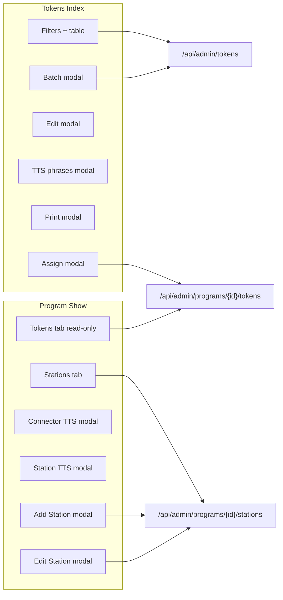

# Admin UX map: Tokens, Program → Stations & Tokens tab

Structured inventory of **current** UI for remapping. Implementation lives mainly in `resources/js/Pages/Admin/Tokens/Index.svelte` and `resources/js/Pages/Admin/Programs/Show.svelte`.

---

## Routes (Inertia pages)

| Path | Name | Page component |
|------|------|----------------|
| `/admin/tokens` | `tokens` | `Admin/Tokens/Index` |
| `/admin/tokens/print` | `tokens.print` | `Admin/Tokens/Print` (print layout) |
| `/admin/programs/{program}` | `programs.show` | `Admin/Programs/Show` |

Program show supports `?tab=` and localStorage `flexiqueue:admin-program-tab-{id}` for default tab.

---

## Shared props & gates (affect both areas)

From `HandleInertiaRequests` / page props (typical):

- **`server_tts_configured`**: when false, both Tokens and Program → Stations show a warning banner linking to **Configuration → Integrations**.
- **`tts_allow_custom_pronunciation`**: when false, **station phrase** and **token phrase** custom text fields are hidden (voice/rate may still show).

Edge / package mode may set **`admin_read_only`**: disables mutating actions (tooltips explain sync-from-central).

---

## 1. Token Management (`/admin/tokens`)

### Page chrome

- **Title**: “Token Management”
- **Subtitle**: physical tokens + QR, combine with stations.
- **Primary CTA**: “Create Batch” (desktop header button; **mobile FAB** bottom-right).
- **Banner**: missing ElevenLabs → link to Integrations.

### Filters (sticky, expandable)

- **Search** (physical ID substring)
- **Status** (e.g. available / in_use)
- **Prefix**
- **Assignment**: All | Unassigned | Global | per-program (`program_id:N`)
- **Is global**: All | Yes | No
- **TTS status**: All | Not generated | Generating | Pre-generated | Failed  
- Changing filters debounces refetch; **pagination** (`per_page` 10–100, default 25).

### Data source

- `GET /api/admin/tokens` with query params above (+ `page`).

### Default segment 1 phrases (site-wide)

- Collapsible block **above the filters** (collapsed by default): **pre-phrase** and **token bridge tail** per language (EN / FIL / ILO), **Play sample**, **Save defaults** → `PUT /api/admin/token-tts-settings` (full per-lang merge including `voice_id`, `rate`, `token_phrase`, `closing_without_segment2` from the same fetch).
- Voice/speed, playback toggles, default token phrase, and “closing when segment 2 off” remain under **Configuration → Audio & TTS** (`?tab=token-tts`).

### Desktop table (`lg+`)

Columns: **Select all** | **Physical ID** (+ “Global” badge) | **Status** | **Assigned** (program names / Global / Unassigned) | **Offline TTS** (status chips) | **Actions**.

- Row checkbox only for `available` / `deactivated`; **in_use** shows disabled ban icon.

### Mobile / tablet

- Card grid + “Select all” above grid.
- Row actions mirror desktop (Edit, Print, Assign, etc.).

### Bulk selection toolbar (when any selected)

Actions: **Print** | **Assign** | **TTS** (tokens needing regen) | **Deactivate** (available only) | **Delete** (not in_use) | **Clear**.

### Per-row actions

- **Edit** → edit modal (pronunciation mode, global flag, status-related flows).
- **Edit** → **Pronounce as** (letters/word). **Letters**: no per-language speech block (ID uses built-in phonetics). **Word**: per-language voice, rate, optional pre-phrase, optional **token phrase** if custom pronunciation is allowed; **Generate token audio** when not already pre-generated; save via token API. Site-wide pre-phrase / bridge tail: collapsible **Default segment 1 phrases** above.
- **Print** → print modal (template/settings then navigates or submits print flow).
- **Assign** (if unassigned) → assign-to-program modal.
- **Unassign** (single program) inline when applicable.
- **Activate / Deactivate** as applicable.
- **Delete** when allowed.
- **In use** → may open **cancel session** confirmation modal before destructive ops.

### Modals (Tokens page)

| Modal | Purpose |
|-------|---------|
| Create Batch | prefix, range, count, pronounce-as letters/word, global, offline TTS toggle, per-lang TTS defaults, submit → `POST /api/admin/tokens/batch` |
| Cancel session confirm | confirm ending session for in-use token |
| Edit token | physical alias / pronounce-as, global, programs summary, TTS fields; `PUT /api/admin/tokens/{id}` |
| Assign to program | pick program; `POST` program tokens API |
| TTS phrases | per-token EN/FIL/ILO config + previews; ties to token TTS settings API |
| Print | cards per page, paper, orientation, hints, cut lines, logo, footer, bg; opens print route |

### Related APIs (admin)

- `GET/PUT/DELETE` tokens, `POST` batch, batch-delete, regenerate TTS  
- Program token assign: `GET/POST/DELETE` under `/api/admin/programs/{program}/tokens`

---

## 2. Program detail (`/admin/programs/{program}`)

### Tabs (`VALID_TABS`)

`overview` | `public-page` | `processes` | `stations` | `staff` | `tokens` | `tracks` | `diagram` | `settings`

This map focuses on **stations** and **tokens**; other tabs are adjacent context (processes required before station process checkboxes).

### Stations tab

**Header**

- Title: “Stations” — “Manage service points…”
- **Connecting phrase TTS** button → modal titled **Station announcement — Segment 2** (program connector between token call and station name; save may offer **regenerate all station TTS** confirm).
- **Add Station** → create modal.

**Empty state**

- Illustration + “Create First Station”.

**Station cards** (grid)

Each card shows:

- Name, **Active / Inactive** pill
- **Staff** capacity (desks)
- **Clients** per turn (`client_capacity`)
- Footer actions:
  - **Activate / Deactivate**
  - **Generate TTS** (enabled when station TTS status is **failed**; queue/sync rules apply)
  - **Station TTS** (volume icon) → **Station TTS modal** (per-lang voice, rate, optional station phrase + **Sample** per language)
  - **Edit** → full edit station modal (name, capacities, process checkboxes, per-lang TTS blocks — mirrors create)
  - **Delete** → confirm

**Create / Edit station modals**

- Name, staff capacity, client capacity
- **Processes** multi-select (≥1 required; blocked if no processes)
- **Station TTS (per language)**: EN / FIL / ILO — voice, speed slider, optional **station phrase** if `allowCustomPronunciation`

**APIs**

- Stations CRUD under `/api/admin/programs/{program}/stations` (see `StationController`)
- `POST .../regenerate-station-tts` for bulk regen after connector changes

### Tokens tab (inside program)

- Title: **Tokens assigned to this program**
- Copy: **read-only** list; assign/unassign via **Tokens** page link.
- `GET /api/admin/programs/{program}/tokens?assigned_only=…` (pagination optional)
- Desktop: small table — **Physical ID**, **Status**
- Mobile: card grid with same fields
- Empty state → link to `/admin/tokens`

---

## 3. Codemapper bundle

To generate a single text dump of the implementation files for LLM or offline review:

1. Open **Codemapper** and load config:  
   `.tmp-codemapper/codemapper/config/flexiqueue-admin-tokens-program-station.json`
2. From `.tmp-codemapper/codemapper`, run:  
   `..\dist\codemapper.exe --config flexiqueue-admin-tokens-program-station --oneshot`  
   Output path in config: `codemapper-output/admin_tokens_program_station_map.txt`

**Where is the file?** Repo root: `codemapper-output/admin_tokens_program_station_map.txt`. That path is **not** fully gitignored (only other files under `codemapper-output/` are), so it should show in the file explorer and can be committed.

**Note:** On some Windows consoles the bundled `codemapper.exe` can hit a `UnicodeEncodeError` when printing status. Regenerate the map with PowerShell (see project history) or Codemapper on macOS/Linux if needed.

That bundle includes this UX map plus the listed PHP/JS/Svelte sources.

---

## 4. Quick dependency graph (UX remapping)

Use this doc when changing information architecture (e.g. moving assign flows, merging TTS into one surface, or splitting station vs connector configuration).
